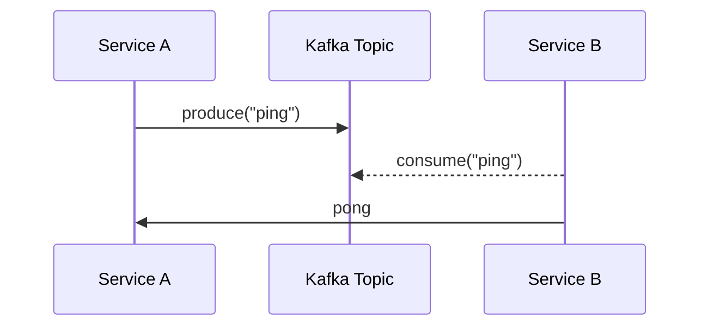

## Exercise: Microservices and Decoupling with Kafka

### Step 2: Adding Kafka (Decoupled via Queue)

#### Description:

* Service A produces ping messages to a Kafka topic.
* Service B is a consumer that reads messages from the topic.
* If B crashes, Kafka retains the messages. When B recovers, it continues from where it left off.

#### Mermaid Diagram:

---

**[MICROSERVICES PART 3](https://github.com/elevy99927/Jenkins-k8s/blob/main/Final-Exam/MicroServices/MS-Part3.md)**