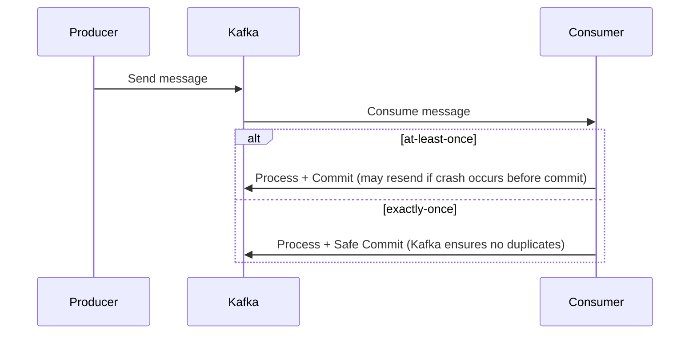
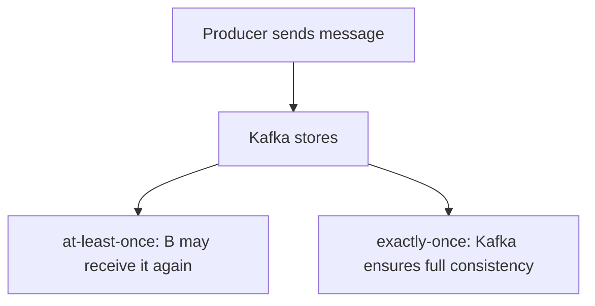
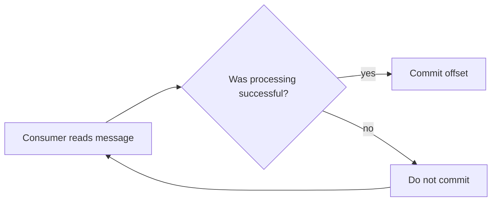

## Exercise: Microservices and Decoupling with Kafka

### Step 3: What if B crashes after consuming the message?

#### Problem:

* Kafka marks the message as "read" at the time of pull.
* If B crashes after pulling but before processing – the message may be lost and not processed again.

---

## Advanced Exercise:

### Question:

> Find a way to ensure the message is not lost if Service B crashes after consuming it but before finishing processing.

#### Guiding Questions:

1. What is the difference between at-least-once and exactly-once?

2. How can offset be controlled manually?

* The offset is the position of the message in Kafka's topic.
* The consumer can be configured to commit the offset only after successful processing.
* This ensures that if the service crashes, the message remains in Kafka and is reprocessed upon recovery.

3. What mechanisms can help with failed message processing?
4. Can checkpointing or a transactional outbox be used?

