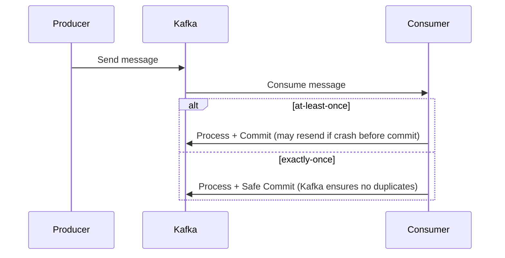
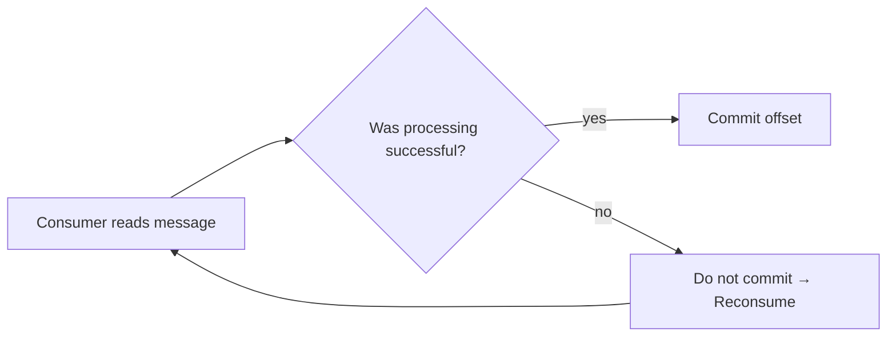
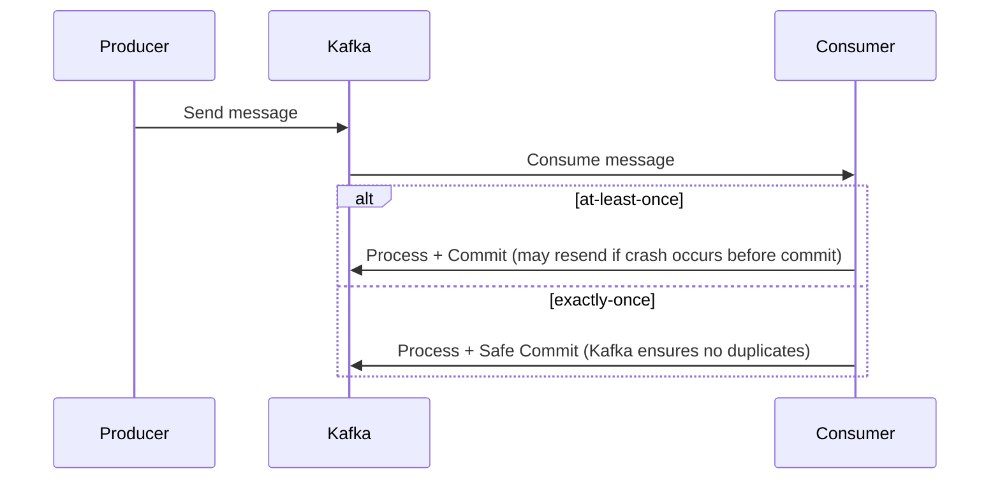
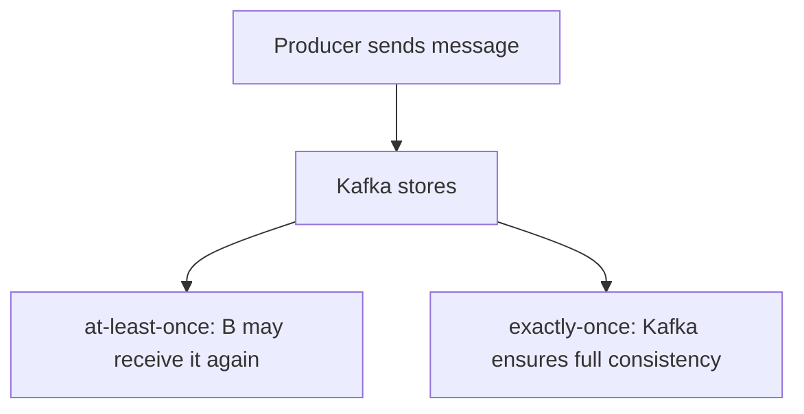
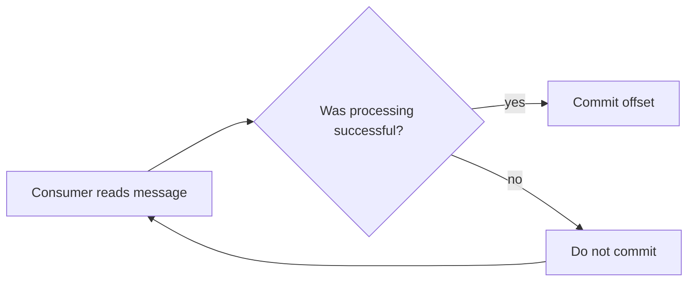

## Exercise: Microservices and Decoupling with Kafka

### Step 3: What if B crashes after consuming the message?

#### Problem:

* Kafka marks the message as "read" at the time of pull.
* If B crashes after pulling but before processing – the message may be lost and not processed again.

#### Question:

> Find a way to ensure the message is not lost if Service B crashes after consuming it but before finishing processing.

---
---
---

### Hints:

1. Understand the difference between **at-least-once** and **exactly-once** delivery semantics.

   * Which approach tolerates duplicate processing?
   * Which one ensures message is processed only once?

2. Can you delay offset commit until processing completes?

   * What happens if you **commit only after** success?
   * What happens if there's a **failure before commit**?

3. What Kafka features or APIs enable transactional behavior?

   * Have you explored Kafka’s transaction support (e.g., `initTransactions`, `sendOffsetsToTransaction`)?
   * Can you atomically process and store data?

4. Do you need idempotent message processing?

   * If the same message is processed multiple times, will it break logic?
   * How can you make your consumer idempotent?

---

---
---
---

#### Hints:

1. What is the difference between at-least-once and exactly-once?

2. How can offset be controlled manually?

* The offset is the position of the message in Kafka's topic.
* The consumer can be configured to commit the offset only after successful processing.
* This ensures that if the service crashes, the message remains in Kafka and is reprocessed upon recovery.

3. What mechanisms can help with failed message processing?
4. Can checkpointing or a transactional outbox be used?

**[MICROSERVICES - Solution](https://github.com/elevy99927/Jenkins-k8s/blob/main/Final-Exam/MicroServices/Solution.md)**