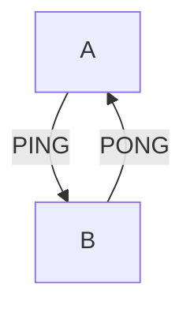

## Exercise: Microservices and Decoupling with Kafka

### Objective

In a microservices architecture, services must communicate with each other. Synchronous communication can create tight coupling and dangerous dependencies. Kafka provides a Pub/Sub solution that enables decoupling between services and reduces interdependence.

---

### Step 1: Direct Communication between Services (Tightly Coupled)

#### Description:

* Service A sends ping requests to Service B.
* Service B responds with pong.

#### Mermaid Diagram:

#### Issues:

1. If A crashes – messages are lost.
2. If B is slow, A may overwhelm it with requests – causing B to crash and lose data.
3. Synchronous HTTP communication creates tight dependency, reducing system stability.

---

**[MICROSERVICES PART 2](https://github.com/elevy99927/Jenkins-k8s/blob/main/Final-Exam/MicroServices/MS-Part2.md)**