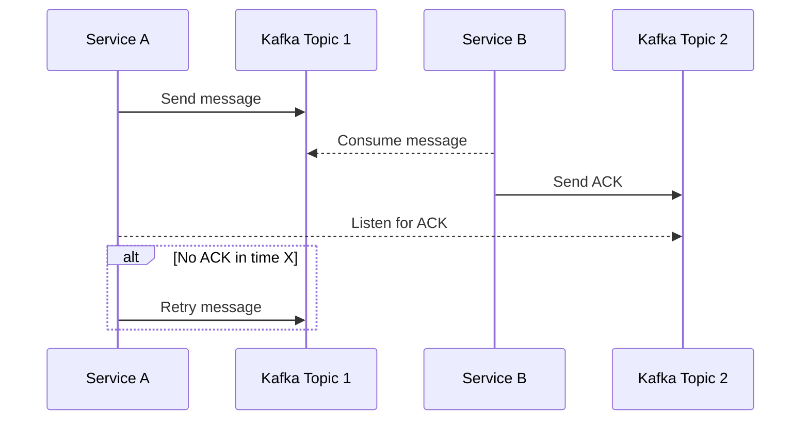

## What if B crashes after consuming the message?

### Problem:

* Kafka marks the message as "read" at the time of pull.
* If B crashes after pulling but before processing – the message may be lost and not processed again.

### Question:

> Find a way to ensure the message is not lost if Service B crashes after consuming it but before finishing processing.

---

## Solution 1: Manual Offset Commit After Processing

The consumer should only commit the offset **after** the message is successfully processed. This prevents Kafka from marking the message as "done" prematurely.

### Pros:

* Simple to implement
* Works with most Kafka clients

### Cons:

* May result in **duplicate processing** if the consumer crashes after processing but before committing
* Requires idempotent logic on the consumer side

#### Mermaid Diagram:

---

## Solution 2: Kafka Transactions (Exactly-Once Semantics)

Use Kafka's **transactional producer and consumer** API to ensure that reading, processing, and writing results are atomic.

### Pros:

* Ensures **exactly-once processing** (no duplicates)
* Guarantees both read and write sides are consistent

### Cons:

* More complex to configure
* Slight performance overhead
* All services involved must support Kafka transactions

#### Mermaid Diagram:

---

## Solution 3: Acknowledgment via Secondary Topic

In this pattern, Service A (the producer) sends a message to Kafka Topic 1. Service B (the consumer) processes the message and then sends an acknowledgment to Kafka Topic 2. Service A monitors Topic 2 for confirmations. If no acknowledgment is received within X seconds, A retries the message.

### Pros:

* Ensures reliability via acknowledgment
* A can control retries based on timeout
* No need for Kafka transactions

### Cons:

* Adds complexity (requires monitoring acknowledgments)
* Messages may be processed more than once unless B is idempotent

#### Mermaid Diagram:

---
