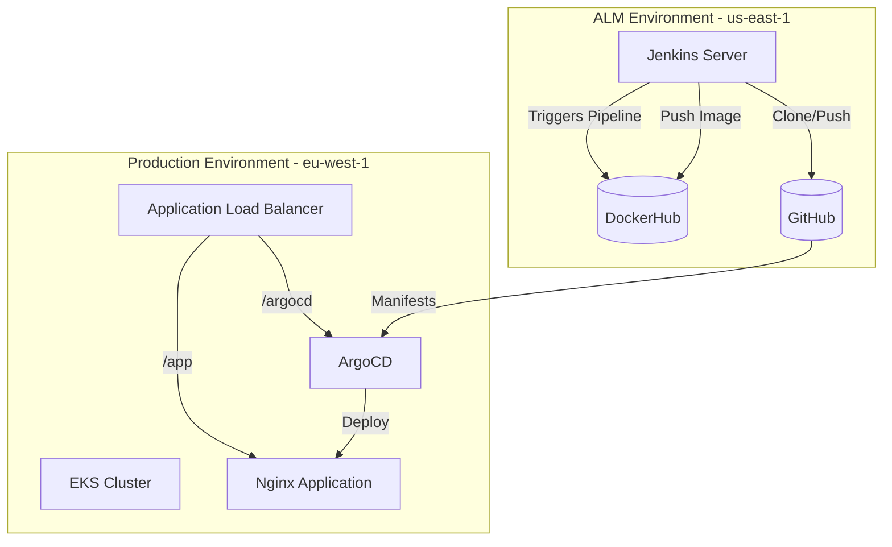

# DevOps Practical Exam - AWS & Kubernetes

## Exam Objective
This exam is designed to assess your ability to design, build, and maintain cloud infrastructure using AWS and Kubernetes, while applying CI/CD and GitOps principles. You are expected to demonstrate proficiency with Terraform, Jenkins, ArgoCD, and Docker.

---

## Scenario: Distributed Architecture Environment

You are required to build an infrastructure with two logical environments within AWS:

### VPC 1 - ALM Environment (Application Lifecycle Management)
- Intended for development and integration tools: Jenkins, GitHub, DockerHub
- **Must include:**
  - [Jenkins Server](https://github.com/elevy99927/Jenkins-k8s/tree/main/Part4-CICD/04-Jenkins) (on EC2 or deployed in EKS)
  - Internet access for pulling source code and pushing Docker images
  - Secure networking allowing restricted external access

### VPC 2 - Production Environment
- **Must include:**
  - Managed [Kubernetes](https://github.com/elevy99927/k8s) cluster (EKS)
  - [ArgoCD](https://github.com/elevy99927/Jenkins-k8s/blob/main/Part4-CICD/04-ArgoCD/README.md) installed as a GitOps Controller
  - External ALB (Application Load Balancer) to expose services

- **Nice To Have:** (better if installed as IaC)
  - Cert Manager
  - Velero backups to S3
  - Route 53


---

---

## Exam Tasks (Task Breakdown)

### Step 1: Plan & Build Infrastructure Using Terraform
1. Create two VPCs in two separate AWS regions (e.g., `us-east-1`, `eu-west-1`)
2. For each VPC:
   - Create public and private subnets
   - Set up Internet Gateway and NAT Gateway
   - Configure appropriate Security Groups
3. Ensure Jenkins can access GitHub and DockerHub.  

**Deliverables:**
- Terraform code for both VPCs in separate folders
- `terraform apply` completes successfully
- Outputs include VPC IDs, subnets, and NAT gateways
---

### Step 2: Setup Jenkins
4. Install Jenkins:
   - Either on an EC2 instance or as a Deployment inside EKS
5. Create a basic pipeline that:
   - Clones code from GitHub
   - Builds a Docker image
   - Pushes it to hub.docker.io.  

**Deliverables:**
- Jenkins is accessible (via LoadBalancer or EC2 Public IP)
- A functioning pipeline defined in `pipeline.groovy`
- Sample build proof (console output or screenshot)
---


### Step 3: Provision Kubernetes Cluster & Install ArgoCD
6. Provision an EKS cluster with at least two worker nodes
7. Install ArgoCD under a dedicated namespace
8. Expose ArgoCD using a LoadBalancer service.  


**Deliverables:**
- EKS cluster provisioned with kubeconfig access
- ArgoCD installed and accessible via LoadBalancer IP
- Namespace `argocd` present and healthy pods running
---

### Step 4: Expose Services via ALB
9. Install the AWS Load Balancer Controller in the EKS cluster
10. Create an ALB Ingress that:
    - Routes `/argocd` to the ArgoCD UI
    - Routes `/app` to a sample application (e.g., nginx).  


**Deliverables:**
- ALB is provisioned by the Load Balancer Controller
- Ingress routes `/argocd` to ArgoCD UI and `/app` to sample app
- Output: Public DNS name or IP
---

### Step 5: Setup GitOps with ArgoCD
11. Prepare a GitHub repository with YAML manifests for:
    - Nginx Deployment
    - ClusterIP Service
    - Ingress
12. Define an ArgoCD App-of-Apps configuration that pulls these manifests.  


**Deliverables:**
- GitHub repository with valid K8s manifests
- App-of-Apps YAML points to your repo and successfully syncs
- ArgoCD UI shows synced and healthy application
---

### Step 6: Docker Image Management
13. Create a Dockerfile for a basic application (e.g., nginx with custom `index.html`)
14. Build the image via Jenkins pipeline
15. Push the image to DockerHub.  


**Deliverables:**
- Dockerfile in `jenkins/` folder
- Image pushed to DockerHub under your user
- Reference to this image used in deployment manifest
---

## Required Folder Structure
```
devops-exam/
├── terraform/
│   ├── vpc-dev/
│   ├── vpc-prod/
│   ├── eks-prod/
│   └── alb/
├── jenkins/
│   ├── Dockerfile
│   └── pipeline.groovy
├── argo/
│   └── app-of-apps.yaml
├── manifests/
│   ├── nginx-deploy.yaml
│   ├── service.yaml
│   └── ingress.yaml
└── README.md
```

---

## Evaluation Criteria
| Component                    | Score |
|-----------------------------|-------|
| Terraform Infrastructure     | 25    |
| Jenkins Setup and Pipeline   | 20    |
| EKS + ArgoCD Configuration   | 20    |
| ALB + Ingress Functionality  | 10    |
| GitHub + DockerHub Integration | 15  |
| Documentation & Structure    | 10    |
| **Total**                    | **100** |

---

## Validation & Testing
- Run `kubectl get all -n argocd` to verify ArgoCD is running
- Access ALB endpoints: `https://yourip.nip.io/argocd` and `https://yourip.nip.io/app` for external access
- Ensure Jenkins is running and can execute a successful pipeline

---

Good luck! 
