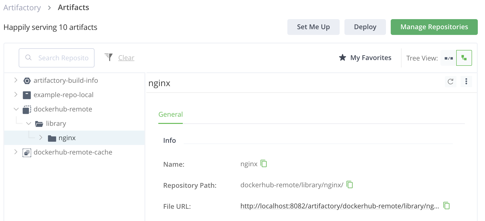
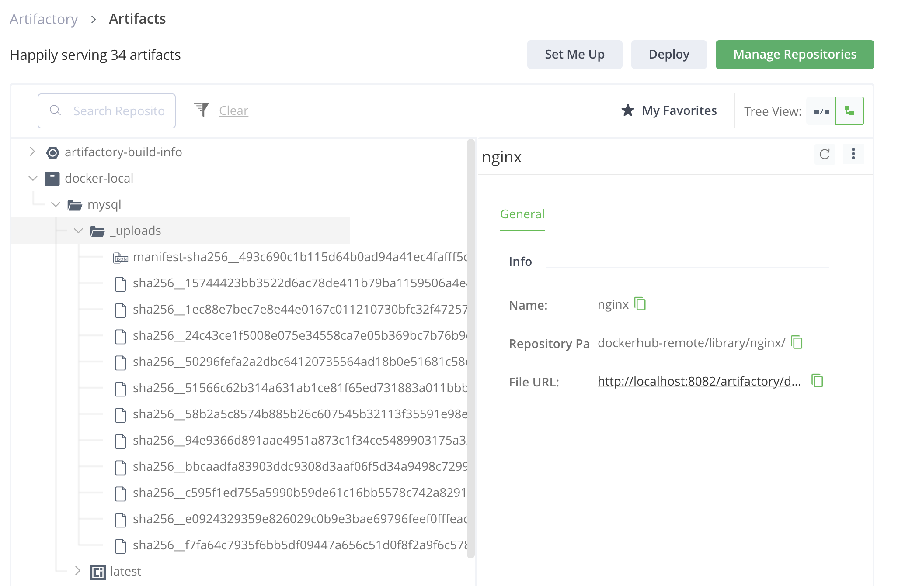

### **README.md**

# **Exercise: Using a Local JFrog Installation for Docker Repositories**

This exercise demonstrates setting up and using Docker repositories in a local JFrog Artifactory instance. You will configure a remote repository, a local repository, and a virtual repository, and interact with them using Docker commands.

---

## **Prerequisites**
- **JFrog Artifactory** is running locally:
  - **UI Access**: [http://localhost:8082/](http://localhost:8082/)
  - **Repository Port**: `localhost:8081`
- Docker is installed and configured on your machine.
- Default credentials for JFrog Artifactory:
  - **Username**: `admin`
  - **Password**: You password, set during installation.

---

## **Part 1: Remote Docker Repository**

### **1. Create a Remote Repository**
1. Log in to the JFrog Artifactory UI: [http://localhost:8082/](http://localhost:8082/).
2. Navigate to **"Administration" > "Repositories" > "Remote" > "New Remote Repository"**.
3. Choose **Docker** as the package type and configure the following settings:
   - **Repository Key**: `dockerhub-remote`
   - **Remote URL**: `https://registry-1.docker.io`
   - **Enable Caching**: Check this option.
4. Save the configuration.

---

### **2. Login to the Repository from the Command Line**
Run the following command to authenticate Docker with your Artifactory instance:
```bash
docker login localhost:8081
Username: admin
Password: <your-password>
```
Replace `<your-password>` with your actual password.

Expected output:
```
Login Succeeded
```

---

### **3. Pull a Docker Image from the Remote Repository**
Pull an image from Docker Hub via your remote repository:
```bash
docker pull localhost:8081/dockerhub-remote/nginx

```


---

### **4. View the Pulled Image in the Artifactory UI**
1. Open your browser and navigate to:
   [http://localhost:8082/ui/repos/tree/General/dockerhub-remote/library/nginx](http://localhost:8082/ui/repos/tree/General/dockerhub-remote/library/nginx)
2. Verify that the image is cached in the remote repository.

---

---
---

## **Part 2: Virtual Docker Repository**

### **1. Create a Local Docker Repository**
1. In the Artifactory UI, navigate to **"Repositories" > "Local" > "New Local Repository"**.
2. Choose **Docker** as the package type and configure the following:
   - **Repository Key**: `docker-local`.
3. Save the configuration.

---

### **2. Create a Virtual Docker Repository**
1. Navigate to **"Repositories" > "Virtual" > "New Virtual Repository"**.
2. Choose **Docker** as the package type and configure the following:
   - **Repository Key**: `docker-virtual`.
   - **Included Repositories**: Add `dockerhub-remote` and `docker-local`.
   - **Default Deployment Repository**: Select `docker-local`.
3. Save the configuration.

---

### **3. Pull the MySQL Image**
Pull the `mysql` image via your virtual repository:
```bash
docker pull mysql
```

---

### **4. Tag the MySQL Image**
Tag the MySQL image for your virtual repository:
```bash
docker tag mysql localhost:8081/docker-remote/mysql
```
---


### **5. Push the MySQL Image**
Push the tagged MySQL image to the virtual repository:
```bash
docker push localhost:8081/docker-remote/mysql
```

---
## Your push will fail!
find out why, fix it and continue :)

## Solution

### **6. Tag the MySQL Image**
Tag the MySQL image for your virtual repository:
```bash
docker tag mysql localhost:8081/docker-virtual/mysql
```
---


### **7. Push the MySQL Image**
Push the tagged MySQL image to the virtual repository:
```bash
docker push localhost:8081/docker-virtual/mysql
```

---


---
### **8. View the Pushed Image in the Artifactory UI**
1. Open your browser and navigate to:
   [http://localhost:8082/ui/repos/tree/General/docker-local](http://localhost:8082/ui/repos/tree/General/docker-local)
2. Verify that the `mysql` image is stored in the local repository.

---
---

## **Part 3: Securiry***
### **1. Create a new user **
Create a new user with admin privileges. 
---

### **2. Multi-factor Authentication**
Under `Security` -> `General` <B>Enable Google Authenticator<B>
---


## **Summary**
This exercise demonstrated:
1. Setting up a **remote Docker repository** to proxy Docker Hub.
2. Creating a **local repository** for internal artifacts.
3. Combining repositories using a **virtual repository** for simplified access and management.
4. Pulling and pushing Docker images through the configured repositories.

You now have a functional setup for managing Docker images with JFrog Artifactory!
