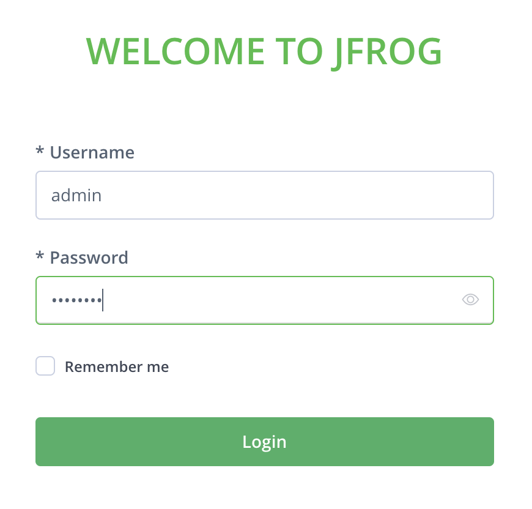
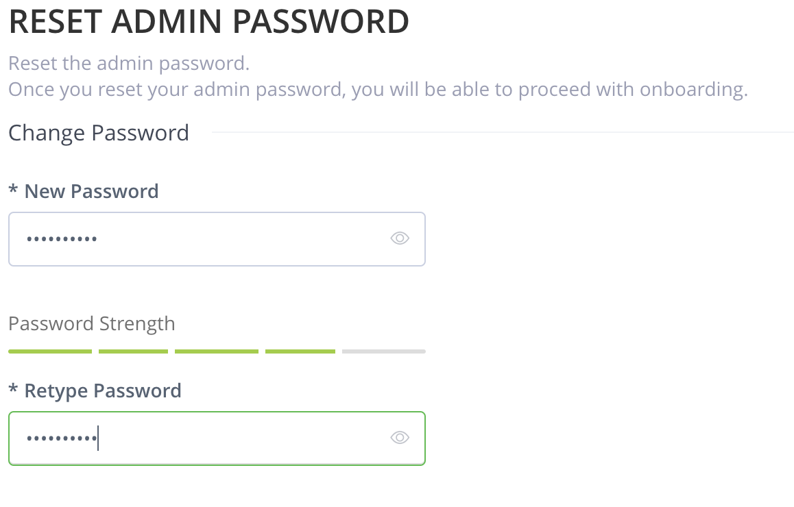
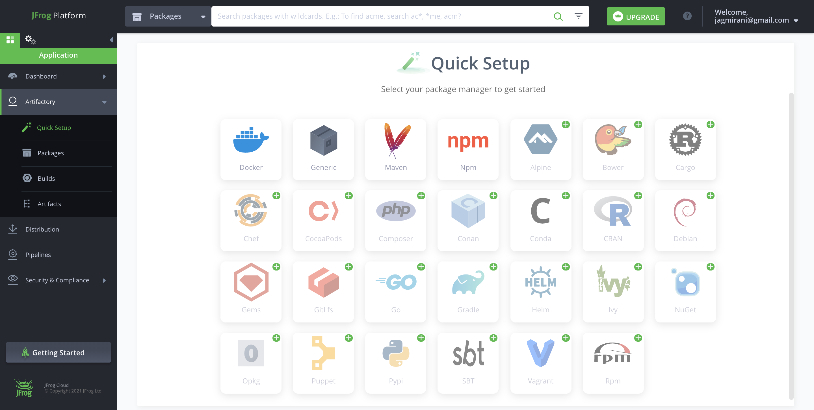
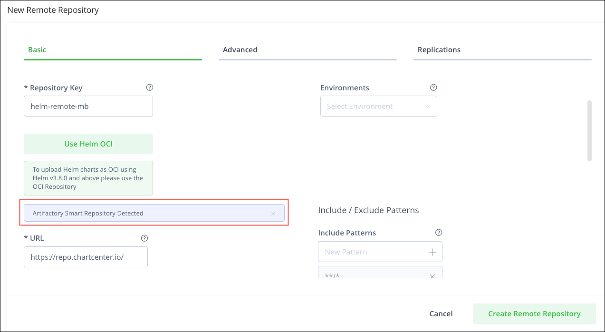

# **Exercise: Installing and Testing JFrog Container Repository (JCR)**

This exercise demonstrates how to set up JFrog Container Repository (JCR) using Docker Compose and configure repositories to manage your artifacts efficiently. By the end of this guide, you will:

1. Install JCR using Docker Compose.
2. Set up a **remote repository** pointing to Docker Hub (docker.io).
3. Set up a **local repository** for internal artifact management.
4. Set up a **virtual repository** to aggregate other repositories.
5. Configure a **Helm Chart repository**.

---

## **1. Installing JCR using Docker Compose**

### **System Requirements**
- Ensure your system meets the [system requirements](https://jfrog.com/help/r/jfrog-installation-setup-documentation/system-requirements).
- **Docker**: Version 20.10.10 or higher.
- **Docker Compose**: Version 1.24 or higher.

### **Installation Steps**
1. **Download JFrog JCR**:
   Download the Docker Compose package from [JFrog's download page](https://jfrog.com/download-jfrog-container-registry/).

2. **Extract the Docker Compose Archive**:
   ```bash
   wget -O jfrog-artifactory-jcr-compose.tar.gz https://releases.jfrog.io/artifactory/bintray-artifactory/org/artifactory/jcr/docker/jfrog-artifactory-jcr/[RELEASE]/jfrog-artifactory-jcr-[RELEASE]-compose.tar.gz
   tar -xvf jfrog-artifactory-jcr-compose.tar.gz
   cd artifactory-jcr-<version>
   ```

3. **Run the Configuration Script**:
   Run the interactive installation script and follow the instructions:
   ```bash
   bash ./config.sh
   ```

4. **Start PostgreSQL and JCR Services**:
   Start the PostgreSQL database:
   ```bash
   docker compose -p rt-postgres -f docker-compose-postgres.yaml up -d
   ```
   Start the JCR services:
   ```bash
   docker compose -p rt up -d
   ```

5. **Access the JCR Web Interface**:
   Open your browser and navigate to:
   <B><I>If runing on you local machine YOUR-IP could be localhost. </I></B> 
   ```
   http://<YOUR-IP>:8082/ui/
   ```
---
**JCR Login**
<BR><B>Username:</B> admin
<BR><B>Password:</B> password

---

**Reset your admin password**


---
**JCR Web Interface Overview**:

---

## **2. Setting Up a Remote Repository**

### **What is a Remote Repository?**
A remote repository proxies external repositories (e.g., Docker Hub). It caches artifacts locally, reducing network dependency and improving performance.


### **Steps to Create a Remote Repository**:
1. Log in to the JCR web interface.
2. Navigate to **"Repositories" > "Remote" > "New Remote Repository"**.
3. Select **"Docker"** as the package type.
4. Configure the following settings:
   - **Repository Key**: `docker-remote`
   - **Remote URL**: `https://registry-1.docker.io`
   - **Enable Caching**: Check this option to cache artifacts locally.
5. Save the configuration.

### **Why Use a Remote Repository?**
- Ensures high availability of external dependencies by caching them locally.
- Reduces network latency and improves build performance.

---
**Repository Configuration Example**:

---

## **Common Docker Commands**
- Start the services:
  ```bash
  docker compose -p rt up -d
  ```
- Stop the services:
  ```bash
  docker compose -p rt down
  ```
- View logs:
  ```bash
  docker compose -p rt logs
  ```

---
---
---
# Jfrog Labs
## LAB 1 - Docker repos using Jfrog
<BR><a href="./Docker-Repo.md"> Lab 1 - Docker repo </A>
---
---
---

## **Conclusion**

This guide covers setting up JCR, configuring repositories, and understanding their use cases. With JCR, you can efficiently manage and distribute artifacts for development and deployment workflows. For more advanced use cases, explore JFrog’s documentation.
---

## License

This project is licensed under the MIT License.

---
## **Contact**
For questions or feedback, feel free to reach out:
- **Email**: eyal@levys.co.il
- **GitHub**: [https://github.com/elevy99927](https://github.com/elevy99927)

---

## Hint: helpful commands
```bash
start postgresql:    docker compose -p rt-postgres -f docker-compose-postgres.yaml up -d
stop  postgresql:    docker compose -p rt-postgres -f docker-compose-postgres.yaml down
start:               docker compose -p rt up -d
stop:                docker compose -p rt down
```