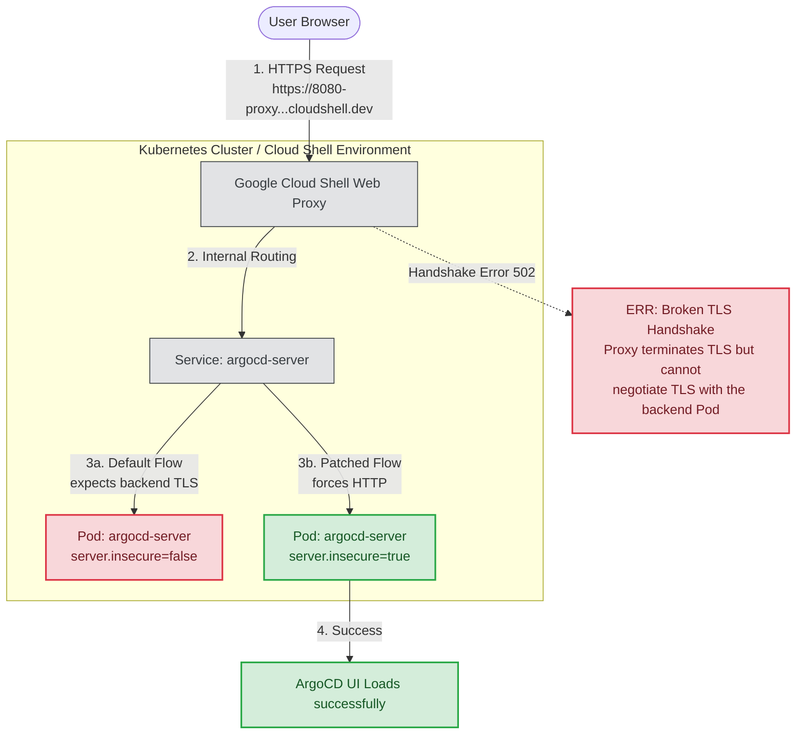

```mermaid

graph TD
    %% Define Styles
    classDef success fill:#d4edda,stroke:#28a745,stroke-width:2px,color:#155724;
    classDef failure fill:#f8d7da,stroke:#dc3545,stroke-width:2px,color:#721c24;
    classDef component fill:#e2e3e5,stroke:#383d41,stroke-width:1px,color:#383d41;

    %% Elements
    User([User Browser]) -->|1. HTTPS Request<br/>https://8080-proxy...cloudshell.dev| Proxy[Google Cloud Shell Web Proxy]
    
    subgraph K8s_Cluster [Kubernetes Cluster / Cloud Shell Environment]
        Proxy -->|2. Internal Routing| Svc[Service: argocd-server]
        
        %% Broken Configuration Path
        Svc -->|3a. Default Flow <br/> expects backend TLS| PodBroken[Pod: argocd-server <br/> server.insecure=false]
        
        %% Fixed Configuration Path
        Svc -->|3b. Patched Flow <br/> forces HTTP| PodFixed[Pod: argocd-server <br/> server.insecure=true]
    end

    %% Error/Success States
    Proxy -.->|Handshake Error 502| Err[ERR: Broken TLS Handshake<br/>Proxy terminates TLS but cannot<br/>negotiate TLS with the backend Pod]
    PodFixed -->|4. Success| OK[ArgoCD UI Loads successfully]

    %% Applying Classes
    class Proxy,Svc component;
    class PodBroken,Err failure;
    class PodFixed,OK success;
```
