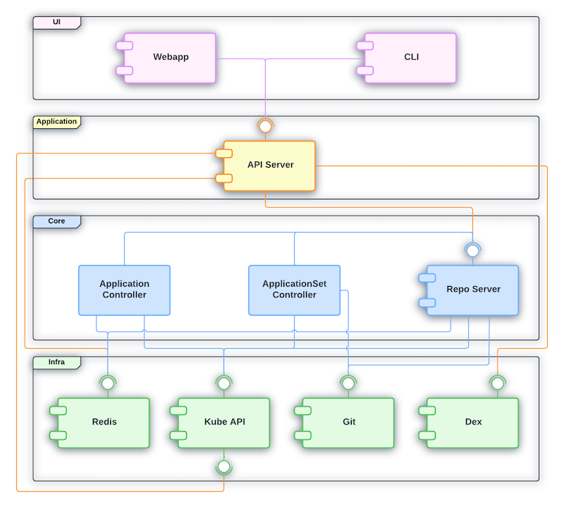
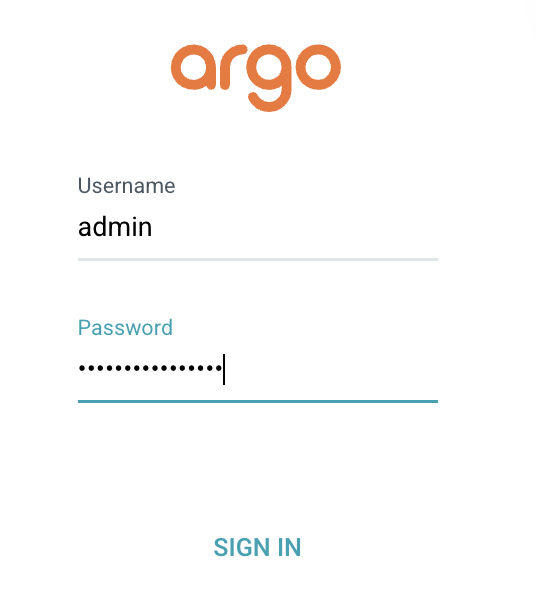

# **ARGOCD**

## **Part 1: ArgoCD Overview and Installation**

### 1. **What is ArgoCD?**
   ArgoCD (Argo Continuous Delivery) is a declarative GitOps tool for Kubernetes. It enables automated deployment of applications by continuously monitoring Git repositories for changes and syncing them to the cluster. ArgoCD ensures that the actual state of Kubernetes resources matches the desired state defined in version-controlled manifests (e.g., YAML files). It supports features like automated syncing, application rollbacks, health status tracking, and a user-friendly web UI.

ArgoCD integrates tightly with Git, making it the single source of truth for deployments. Once a change is committed to the repository, ArgoCD automatically applies it to the target environment, enabling fast, auditable, and reliable application delivery.

### 2. **ArgoCD vs. Traditional CI/CD**
   Traditional CI/CD tools (like Jenkins or GitLab CI) often manage both the build and deployment processes in a linear pipeline. These tools usually require scripting to push changes to Kubernetes clusters, and deployments are typically imperative—defined by instructions, not state.

In contrast, ArgoCD focuses purely on the CD part and embraces a **declarative** approach. Rather than instructing Kubernetes on *how* to deploy, ArgoCD focuses on *what* the final state should be. This enables:

* **GitOps workflow**: Git is the source of truth, and deployments are triggered by Git changes.
* **Idempotency and Reconciliation**: ArgoCD constantly monitors the live cluster and reverts drift from the Git-defined state.
* **Separation of Concerns**: Build and test remain in the CI system, while deployment is handled declaratively by ArgoCD.

This separation improves reliability, auditability, and clarity in managing complex Kubernetes environments.

### 3. **ArgoCD Architecture and Components** 
ArgoCD follows a modular architecture designed to support high-availability GitOps workflows for Kubernetes. The architecture is composed of four logical layers:




* **UI Layer**: This is the presentation layer. Users interact with ArgoCD mainly via the Web UI, which provides:

  * Application status visibility
  * Manual or automatic sync control
  * Health and status monitoring
  * Operational management actions

* **Application Layer**: This layer provides the logic and capabilities needed to support UI interactions. It handles:

  * Application definitions
  * Sync and deployment policies
  * Authorization and RBAC enforcement
  * Integration between Git and Kubernetes

* **Core Layer**: The central GitOps engine of ArgoCD. Key components here include:

  * **Application Controller** – performs the reconciliation loop, ensuring that the desired state in Git matches the live cluster
  * **Repository Server** – fetches Git content, renders manifests, and computes diffs
  * Supports rollback, sync, and status reporting

* **Infrastructure Layer (Infra)**: The dependencies ArgoCD requires to function:

  * **Redis** – caching layer to improve responsiveness and reduce load
  * **Dex (optional)** – for Single Sign-On (SSO) via GitHub, LDAP, or SAML
  * **Kubernetes** – as the runtime environment for all ArgoCD components

These components work together to provide a continuous reconciliation loop between Git and the Kubernetes cluster. Applications in ArgoCD are declarative resources that specify the source (Git), target (cluster/namespace), and sync policy (manual or automatic).


## Part 2: **Installing ArgoCD**
   The recommended way to install ArgoCD is by applying the official manifests published on ArtifactHub.

### 1. **Create a Namespace for ArgoCD:**

```bash
kubectl create namespace argocd
```

### 2. **Install ArgoCD Components:**
   Apply the official installation manifest:

```sh
kubectl apply -n argocd -f https://raw.githubusercontent.com/argoproj/argo-cd/stable/manifests/install.yaml
```

---

> **⚠ NOTE for Google Cloudshell**  <BR> Define ArgoCD as `inscure` (due to **Google** cloudshell limitations)
```sh
kubectl patch configmap argocd-cmd-params-cm -n argocd --patch '{"data":{"server.insecure":"true"}}'
kubectl delete pod -n argocd -l app.kubernetes.io/name=argocd-server
 ```
---


### 3. **Verify Installation:**

```sh
kubectl get all -n argocd
```

Ensure that all ArgoCD pods are running in the `argocd` namespace.

### 4. **Get the Initial Admin Password:**

```sh
kubectl get secret argocd-initial-admin-secret -n argocd -o jsonpath="{.data.password}" | base64 -d && echo
```

You can now log in as `admin` with the retrieved password.


### 5. **Accessing the ArgoCD UI:**
   Expose the ArgoCD API server (e.g., using port forwarding or an Ingress controller):

```sh
kubectl -n argocd port-forward svc/argocd-server 8080:80
```

Access it at: [https://localhost:8080](https://localhost:8080)




## Part 3: Basic configuration

### 1. **Configuring Access to a Git Repository**

To restrict which repositories a project is allowed to use, ArgoCD provides the `AppProject` custom resource. Below is an example of a project that explicitly allows the repository `https://github.com/elevy99927/argo-demo-repo.git` and restricts access to a specific branch (`main`):


```yaml
apiVersion: argoproj.io/v1alpha1
kind: AppProject
metadata:
  name: my-project
  namespace: argocd
spec:
  description: Allow access to a specific Git repository and branch
  sourceRepos:
    - https://github.com/elevy99927/argo-demo-repo.git
  destinations:
    - namespace: '*'
      server: https://kubernetes.default.svc
  sourceNamespaces:
    - '*'
```

- [my-project.yaml](https://github.com/elevy99927/Jenkins-k8s/blob/main/Part4-CICD/04-ArgoCD/yamls/my-project.yaml)
```bash
kubectl apply -f yamls/my-project.yaml
```

---

> **Note:** 
- ArgoCD does not natively enforce branch-level restrictions within the `sourceRepos` field directly, so the above `sourceRestrictions` is illustrative and may require enforcement via tooling or custom policy admission controllers.

> **Important:** 
- The repository can also be added to ArgoCD via CLI or UI (`argocd repo add`).


### 2. Managing Applications with ArgoCD

To define and manage an application in ArgoCD, you need to create an `Application` resource that links your Git repository (and branch), the target cluster, and the desired namespace.

Below is an example of an ArgoCD `Application` YAML definition that uses the previously defined `demo-project` and deploys from the `main` branch:

```yaml
apiVersion: argoproj.io/v1alpha1
kind: Application
metadata:
  name: demo-app
  namespace: argocd
spec:
  project: my-project
  source:
    repoURL: https://github.com/elevy99927/argo-demo-repo.git
    path: .
  destination:
    server: https://kubernetes.default.svc
    namespace: default
  syncPolicy:
    automated:
      prune: true
      selfHeal: true
    syncOptions:
      - CreateNamespace=true
```

### Explanation:

* **metadata.name**: Logical name of the application inside ArgoCD.
* **spec.project**: Must match the `AppProject` name (e.g., `demo-project`).
* **source.repoURL**: The Git repository URL.
* **source.targetRevision**: Git branch or tag (e.g., `main`).
* **source.path**: Path in the repository where the Kubernetes manifests reside.
* **destination.server**: The Kubernetes API server to deploy to.
* **destination.namespace**: The namespace in the target cluster.
* **syncPolicy.automated**: Enables automatic syncing, pruning (deleting removed resources), and self-healing.
* **syncOptions**: Allows automatic creation of the namespace if it doesn't exist.

Apply this manifest to register and sync the application with ArgoCD:

- [demo-app.yaml](https://github.com/elevy99927/Jenkins-k8s/blob/main/Part4-CICD/04-ArgoCD/yamls/demo-app.yaml)

```bash
kubectl apply -f yamls/demo-app.yaml
```

---


## Part 4: Hands-On Lab

### Lab Overview ###

This hands-on lab is designed to provide students with practical experience using ArgoCD for both GitOps-style synchronization from their own repositories and direct deployment of Helm charts from remote sources. The lab is divided into basic and advanced sections to gradually build up capabilities.

- [Basic Labs](./Basic-Labs.md)
- [Advanced Labes](./Advanced-Labs.md)


---
---
## Open in Google Cloud Shell

You can directly open this repository in Google Cloud Shell to start exploring the examples:

[](https://shell.cloud.google.com/cloudshell/editor?cloudshell_git_repo=https://github.com/elevy99927/Jenkins-k8s)


---
---
## Contact

For questions or feedback, feel free to reach out:

- **Email**: eyal@levys.co.il
- **GitHub**: [https://github.com/elevy99927](https://github.com/elevy99927)