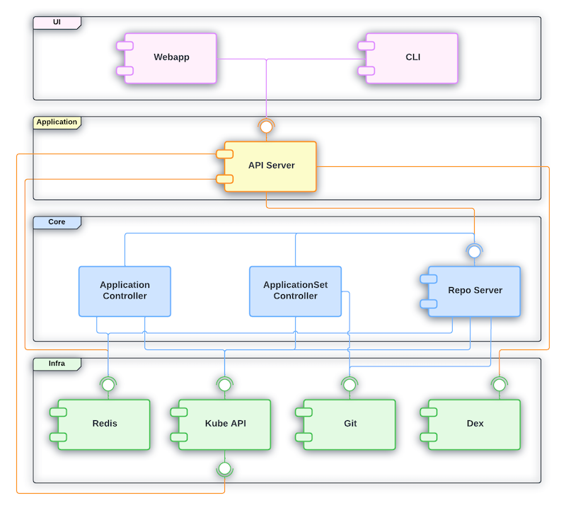
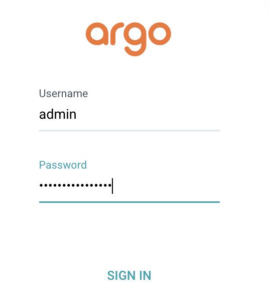

# **ARGOCD**

## **Part 1: ArgoCD Overview and Installation**

## 1. **What is ArgoCD?**
   ArgoCD (Argo Continuous Delivery) is a declarative GitOps tool for Kubernetes. It enables automated deployment of applications by continuously monitoring Git repositories for changes and syncing them to the cluster. ArgoCD ensures that the actual state of Kubernetes resources matches the desired state defined in version-controlled manifests (e.g., YAML files). It supports features like automated syncing, application rollbacks, health status tracking, and a user-friendly web UI.

ArgoCD integrates tightly with Git, making it the single source of truth for deployments. Once a change is committed to the repository, ArgoCD automatically applies it to the target environment, enabling fast, auditable, and reliable application delivery.

## 2. **ArgoCD vs. Traditional CI/CD**
   Traditional CI/CD tools (like Jenkins or GitLab CI) often manage both the build and deployment processes in a linear pipeline. These tools usually require scripting to push changes to Kubernetes clusters, and deployments are typically imperative—defined by instructions, not state.

In contrast, ArgoCD focuses purely on the CD part and embraces a **declarative** approach. Rather than instructing Kubernetes on *how* to deploy, ArgoCD focuses on *what* the final state should be. This enables:

* **GitOps workflow**: Git is the source of truth, and deployments are triggered by Git changes.
* **Idempotency and Reconciliation**: ArgoCD constantly monitors the live cluster and reverts drift from the Git-defined state.
* **Separation of Concerns**: Build and test remain in the CI system, while deployment is handled declaratively by ArgoCD.

This separation improves reliability, auditability, and clarity in managing complex Kubernetes environments.

## 3. **ArgoCD Architecture and Components**
   ArgoCD follows a modular architecture designed to support high-availability GitOps workflows for Kubernetes. The main components are:




* **UI**: A web-based graphical interface that allows users to visually inspect applications, sync states, and trigger actions.
* **API Server**: The main entry point for interacting with ArgoCD. It handles user requests, enforces RBAC policies, and communicates with other internal components.
* **Repository Server**: Clones Git repositories, parses manifests, and performs diff comparisons between the desired (Git) and live (cluster) states.
* **Application Controller**: Continuously monitors application resources and triggers sync operations if discrepancies are detected.
* **Dex (optional)**: Provides Single Sign-On (SSO) integration via external identity providers like GitHub, LDAP, or SAML.
* **Redis**: Used for caching and performance enhancement.

These components work together to provide a continuous reconciliation loop between Git and the Kubernetes cluster. Applications in ArgoCD are declarative resources that specify the source (Git), target (cluster/namespace), and sync policy (manual or automatic).

4. ArgoCD Authentication and Access Control


## Part 2: **Installing ArgoCD**
   The recommended way to install ArgoCD is by applying the official manifests published on ArtifactHub.


### 1. **Create a Namespace for ArgoCD:**

```sh
kubectl create namespace argocd
```

### 2. **Install ArgoCD Components:**
   Apply the official installation manifest:

```sh
kubectl apply -n argocd -f https://raw.githubusercontent.com/argoproj/argo-cd/stable/manifests/install.yaml
```

---

   Define ArgoCD as `inscure` (due to **Google** cloudshell limitations)
```sh
kubectl patch configmap argocd-cmd-params-cm -n argocd --patch '{"data":{"server.insecure":"true"}}'
```
---


### 3. **Verify Installation:**

```sh
kubectl get all -n argocd
```

Ensure that all ArgoCD pods are running in the `argocd` namespace.

### 4. **Get the Initial Admin Password:**

```sh
kubectl get secret argocd-initial-admin-secret -n argocd -o jsonpath="{.data.password}" | base64 -d && echo
```

You can now log in as `admin` with the retrieved password.


### 5. **Accessing the ArgoCD UI:**
   Expose the ArgoCD API server (e.g., using port forwarding or an Ingress controller):

```sh
kubectl -n argocd port-forward svc/argocd-server 8080:80
```

Access it at: [https://localhost:8080](https://localhost:8080)




### 6. **Configuring Access to a Git Repository**
### 7. **Managing Applications with ArgoCD**

---

### **Part 2: Hands-On Lab** *(To Be Defined)*

10. Lab Overview
11. Prerequisites
12. Step-by-Step Instructions
13. Validation & Testing
