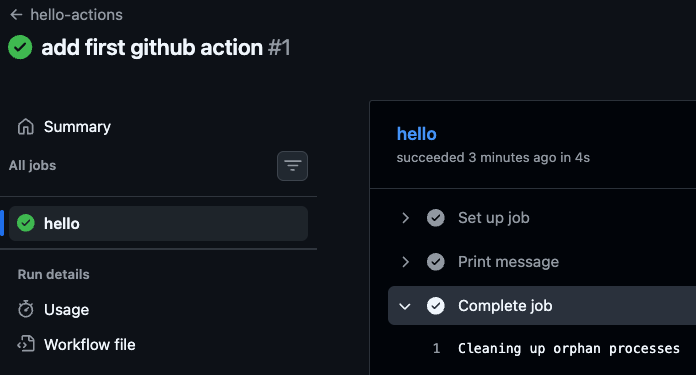

# Basic Exercise

## Objective

Create and execute first GitHub Actions workflow.

---

## Steps

### 1. Create Repository

Create a new GitHub repository, and clone it to your computer.

```bash
git clone https://github.com/YOUR_ID/github-action-example
```


---

### 2. Create Workflow Directory

```bash
mkdir -p .github/workflows
```

---

### 3. Create Workflow File

```bash
touch .github/workflows/hello.yaml
```

---

### 4. Add Workflow Content

```yaml
name: hello-actions

on:
  push:

jobs:
  hello:
    runs-on: ubuntu-latest

    steps:
      - name: Print message
        run: echo "Hello GitHub Actions"
```

---

### 5. Commit and Push

```bash
git add .
git commit -m "add first github action"
git push
```

---

### 6. Open Actions Tab

In your Repository Navigate to `Actions`

```text

```

Verify workflow execution.

---

# Expected log:

```text
Hello GitHub Actions
```



---

# Advanced Exercise

Modify workflow to:

- trigger only on `dev`
- print commit SHA
- add additional step

Example:

```yaml
name: hello-actions

on:
  push:
    branches:
      - dev

jobs:
  hello:
    runs-on: ubuntu-latest

    steps:
      - name: Print hello
        run: echo "Hello GitHub Actions"

      - name: Print commit sha
        run: echo $GITHUB_SHA
```

**try to push to another branch
---
