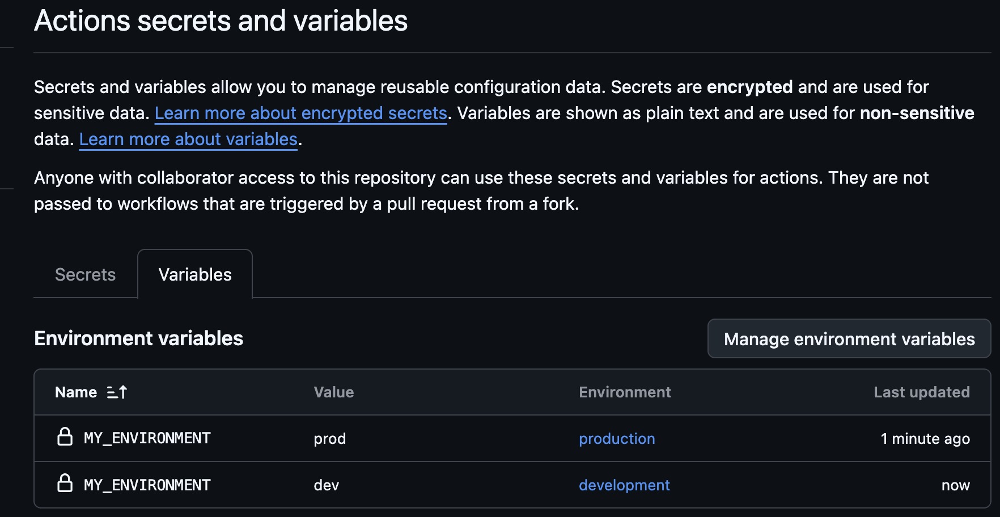

# Solution


## UI Configuration Steps
To make this workflow run successfully, configure the values in your GitHub UI:
### Part 1 (Environment Variables)

   1. Navigate to: Repository → Settings → Environments.
   2. Click New environment and name it production.
   3. Inside the production environment settings, scroll to Environment variables.
   4. Click Add variable, name it MY_ENVIRONMENT, and set the value to production.
   5. Repeat the steps to create a development environment with its own MY_ENVIRONMENT variable.

---



---

### Part 2 (Repository Secrets)

   1. Navigate to: Repository → Settings → Secrets and variables → Actions.
   2. Stay on the Secrets tab (default).
   3. Click New repository secret.
   4. Name it JB_DEMO_USER and input your secret value.

---

## Workflow Solution
Save this file as `.github/workflows/secrets_exercise.yml` in your repository.
```yaml
name: Secrets and Variables Exercise
on:
  push:
    branches:
      - main
  workflow_dispatch:
jobs:
  # Part 1: Production Environment Variables
  production-job:
    name: Run Production Job
    runs-on: ubuntu-latest
    environment: production

    steps:
      - name: Print Production Environment Variable
        run: |
          echo "The current environment is: ${{ vars.MY_ENVIRONMENT }}"
  # Part 2: Repository Secrets
  secrets-job:
    name: Run Secrets Job
    runs-on: ubuntu-latest

    steps:
      - name: Securely Use Repository Secret
        env:
          DEMO_USER: ${{ secrets.JB_DEMO_USER }}
        run: |
          # Note: GitHub automatically masks secrets. 
          # It will print as *** in the log files for security.
          echo "The demo user is: $DEMO_USER"
```
---