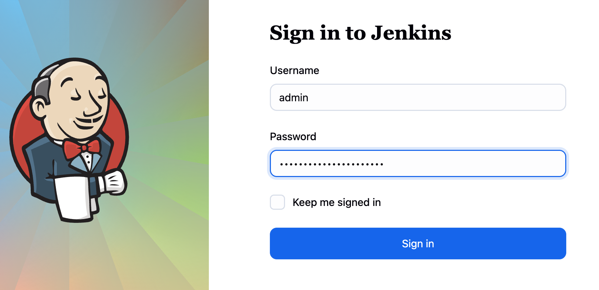
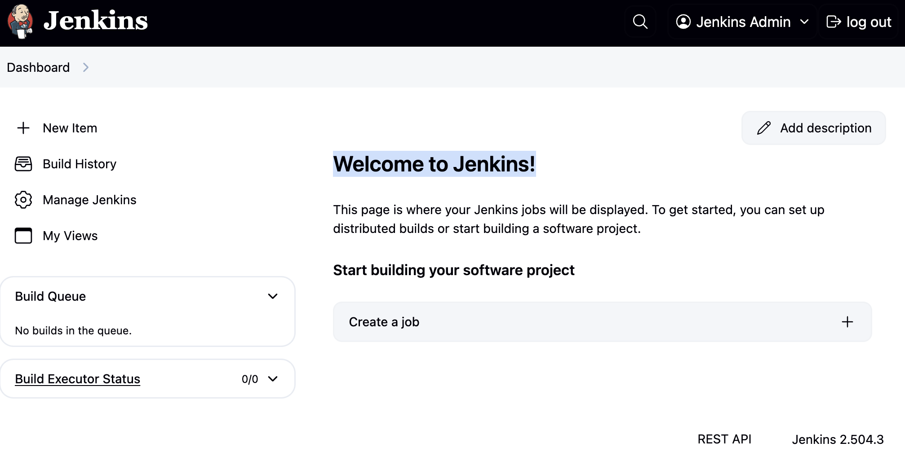

# Jenkins Installation with Helm

## Prerequisites
- Kubernetes cluster running
- Helm 3.x installed
- kubectl configured to access your cluster

## Installation Steps

### 1. Add Jenkins Helm Repository
```bash
helm repo add jenkinsci https://charts.jenkins.io
helm repo update
```
---

### 2. Install Jenkins
```bash
helm install jenkins jenkinsci/jenkins
```

---

### 3. Get Admin Password
```bash
kubectl exec --namespace default -it svc/jenkins -c jenkins -- /bin/cat /run/secrets/additional/chart-admin-password && echo
```
**KEEP YOUR ADMIN PASSWORD!!**

---

### 4. Access Jenkins

#### Option 1: Google Cloud Shell (Port Forward)
```bash
kubectl --namespace default port-forward svc/jenkins 8080:8080
```
Then open http://localhost:8080 in your browser.

#### Option 2: AWS (Load Balancer)
```bash
kubectl get svc jenkins --namespace default
```
Use the EXTERNAL-IP from the LoadBalancer service to access Jenkins.


## Configuration Options

For custom configuration, create a values.yaml file:
```bash
helm show values jenkinsci/jenkins > values.yaml
# Edit values.yaml as needed
helm install jenkins jenkinsci/jenkins -f values.yaml
```

## Useful Commands

- **Upgrade**: `helm upgrade jenkins jenkinsci/jenkins`
- **Uninstall**: `helm uninstall jenkins`
- **Status**: `helm status jenkins`

For more details, visit: https://artifacthub.io/packages/helm/jenkinsci/jenkins

---
### 5. Work with Jenkins

**Login**
use the admin password from [Step 3](https://github.com/elevy99927/Jenkins-k8s/tree/main/Part4-CICD/04-Jenkins/01-install#3-get-admin-password)



---
**Welcome to Jenkins!**



---
### **Next Steps**
<A href="../02-manage/README.md">Manage Jenkins</A>