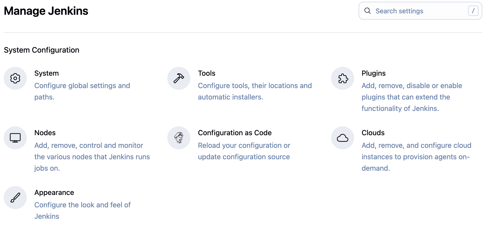
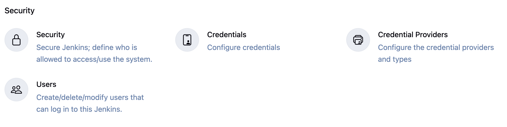

# Manage Jenkins

Access Jenkins management through **Dashboard → Manage Jenkins** to configure your Jenkins instance.

## Management & Configuration

### System
Configure global settings and paths for your Jenkins instance.
Set system properties, environment variables, and global tool configurations.
Define Jenkins URL, admin email, and system message settings.

### Tools
Configure tools, their locations and automatic installers.
Set up JDK, Maven, Gradle, Node.js, and other build tools.
Enable automatic installation and version management for development tools.

### Plugins
Manage plugins that extend Jenkins functionality through installation, updates, and configuration.
Browse the plugin marketplace to add new capabilities like Git integration, Docker support, or notification systems.
Handle plugin updates and dependencies to keep your Jenkins secure and feature-rich.

### Nodes
Add, remove, control and monitor the various nodes that Jenkins runs jobs on.
Configure agent nodes to distribute build workloads across multiple machines.
Set up labels, executors, and node-specific configurations for optimal job distribution.


---

## Configuration as Code
Reload your configuration or update configuration source.
Manage Jenkins configuration through YAML files instead of manual UI configuration.
Enable version control and automated deployment of Jenkins settings.

**Configuration as Code (JCasC)** allows you to define your entire Jenkins configuration in YAML files, replacing manual UI configuration with code-based management.

**Benefits:**
- **Version Control**: Store configuration in Git for tracking changes
- **Automation**: Automatically apply configuration on Jenkins startup
- **Consistency**: Ensure identical configuration across environments
- **Recovery**: Quickly restore Jenkins with the same configuration

**Example jenkins.yaml:**
```yaml
jenkins:
  systemMessage: "Jenkins configured automatically by JCasC"
  numExecutors: 2
  
  securityRealm:
    local:
      allowsSignup: false
      users:
       - id: "admin"
         password: "admin123"

  authorizationStrategy:
    globalMatrix:
      permissions:
        - "Overall/Administer:admin"
        - "Overall/Read:authenticated"

unclassified:
  location:
    url: "http://jenkins.example.com/"
    adminAddress: "admin@example.com"
```

### Clouds
Add, remove, and configure cloud instances to provision agents on-demand.
Set up dynamic agent provisioning with Kubernetes, Docker, or cloud providers.
Configure auto-scaling policies to optimize resource usage and costs.

## Appearance
Configure the look and feel of Jenkins.
Customize themes, logos, and UI elements to match your organization's branding.
Set up custom CSS and JavaScript for advanced UI modifications.


---

## Security

### Security
Secure Jenkins; define who is allowed to access/use the system.
Configure authentication methods, authorization strategies, and security policies.
Set up LDAP, SAML, or other enterprise authentication systems.

### Credentials
Configure credentials for accessing external systems and repositories.
Store and manage passwords, API keys, SSH keys, and certificates securely.
Set up credential scopes and access controls for different projects and users.

### Credential Providers
Configure the credential providers and types.
Define how credentials are stored and retrieved from external systems.
Set up integration with HashiCorp Vault, AWS Secrets Manager, or other credential stores.

### Users
Create/delete/modify users that can log in to this Jenkins.
Manage user accounts, permissions, and group memberships.
Configure user-specific settings and access controls for Jenkins resources.

