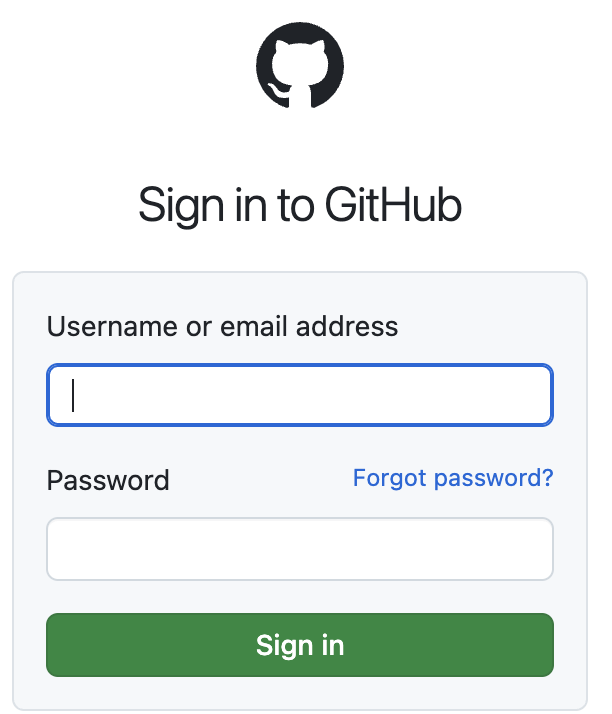

# Jenkins Kubernetes Pipeline

## 1. What are PodTemplates?

**PodTemplate** is a Jenkins Kubernetes plugin feature that defines how Jenkins agents run as Kubernetes pods.

**Key Concepts:**
- **Dynamic Agents**: Creates pods on-demand for pipeline execution
- **Container Templates**: Define different containers within the same pod
- **Resource Management**: Automatic cleanup after job completion
- **Isolation**: Each build runs in its own isolated environment

**Basic Structure:**
```groovy
podTemplate(containers: [
    containerTemplate(name: 'container-name', image: 'image:tag', ttyEnabled: true)
]) {
    node(POD_LABEL) {
        // Pipeline steps here
    }
}
```

## 2. Build Advanced Pipeline

### Step 1: Login to Github
Login to `github` or any othe public git reposiroty.
<BR>


### Step 2: Fork hello-newapp repo
[Hello Newapp repo](https://github.com/elevy99927/hello-newapp)


### Step 3: Create New Repository

1. **Create GitHub Repository**
   - Go to GitHub and create new repository: `hello-newapp`
   - Initialize with README
   - Clone to local machine:
   ```bash
   git clone https://github.com/YOUR_USERNAME/hello-newapp.git
   cd hello-newapp
   ```

### Step 4: Create Dockerfile and Jenkinsfile

**Create Dockerfile:**
```dockerfile
FROM nginx:alpine
COPY index.html /usr/share/nginx/html/
EXPOSE 80
CMD ["nginx", "-g", "daemon off;"]
```

**Create index.html:**
```html
<!DOCTYPE html>
<html>
<head><title>Hello from Jenkins K8s Pipeline</title></head>
<body>
    <h1>Hello World!</h1>
    <p>Built with Jenkins on Kubernetes</p>
</body>
</html>
```

**Create Jenkinsfile:**
```groovy
def appname = "hello-newapp"
def repo = "elevy99927"  // Replace with your DockerHub username
def appimage = "docker.io/${repo}/${appname}"
def apptag = "${env.BUILD_NUMBER}"

podTemplate(containers: [
      containerTemplate(name: 'jnlp', image: 'jenkins/inbound-agent', ttyEnabled: true),
      containerTemplate(name: 'docker', image: 'gcr.io/kaniko-project/executor:debug-v0.19.0', command: "/busybox/cat", ttyEnabled: true)
  ])
  {
    node(POD_LABEL) {
        stage('chackout') {
            container('jnlp') {
            sh '/usr/bin/git config --global http.sslVerify false'
	    checkout scm
          }
        } // end chackout

        stage('Hello') {
            container('docker') {
              echo "Building docker image..."
              sh "echo docker push $appimage"
            }
        } //end hello
    }
}

```

**Push to Repository:**
```bash
git add .
git commit -m "Add Dockerfile and Jenkinsfile"
git push origin main
```

### Step 5: Create Jenkins Pipeline from SCM

1. **Create New Pipeline Job**
   - Dashboard → New Item → Pipeline
   - Name: `k8s-pipeline-scm`

2. **Configure Pipeline from SCM**
   - Pipeline Definition: **"Pipeline script from SCM"**
   - SCM: **Git**
   - Repository URL: `https://github.com/YOUR_USERNAME/hello-newapp.git`
   - Branch: `*/main`
   - Script Path: `Jenkinsfile`

3. **Save and Build**
   - Click "Save"
   - Click "Build Now"

### Check your pipeline


---
## 3. Advanced Pipeline Steps

### Docker Registry Secret (config.json)

The `config.json` contains Docker registry authentication for Kaniko to push images to Docker Hub. <BR>
For example <A Href="https://hub.docker.com/">https://hub.docker.com</a>

#### Step-by-Step Creation:

**1. Create Base64 Encoded Credentials:**
```bash
# Replace YOUR_USERNAME and YOUR_PASSWORD with actual Docker Hub credentials
echo -n "YOUR_USERNAME:YOUR_PASSWORD" | base64
```

**2. Create config.json file:**
```json
{
    "auths": {
        "https://index.docker.io/v1/": {
            "auth": "YOUR_BASE64_ENCODED_CREDENTIALS_HERE"
        }
    }
}
```

**Example:**
- Username: `myuser`
- Password: `mypassword`
- Command: `echo -n "myuser:mypassword" | base64`
- Result: `bXl1c2VyOm15cGFzc3dvcmQ=`

**Final config.json:**
```json
{
    "auths": {
        "https://index.docker.io/v1/": {
            "auth": "bXl1c2VyOm15cGFzc3dvcmQ="
        }
    }
}
```

**3. Create Kubernetes ConfigMap:**
```bash
kubectl create configmap docker-cred --from-file=config.json
```

**4. Verify ConfigMap:**
```bash
kubectl get configmap docker-cred -o yaml
```

### Complete Advanced Jenkinsfile

```groovy

def appname = "hello-newapp"
def repo = "elevy99927"  // Replace with your DockerHub username
def artifactory = "docker.io" 
def appimage = "docker.io/${repo}/${appname}"
def apptag = "${env.BUILD_NUMBER}"

podTemplate(containers: [
      containerTemplate(name: 'jnlp', image: 'jenkins/inbound-agent', ttyEnabled: true),
      containerTemplate(name: 'docker', image: 'gcr.io/kaniko-project/executor:debug-v0.19.0', command: "/busybox/cat", ttyEnabled: true)
  ],
  volumes: [
     configMapVolume(mountPath: '/kaniko/.docker/', configMapName: 'docker-cred')
  ])  {
    node(POD_LABEL) {
        stage('chackout') {
            container('jnlp') {
            sh '/usr/bin/git config --global http.sslVerify false'
	    checkout scm
          }
        } // end chackout

        stage('build') {
            container('docker') {
              echo "Building docker image..."
	      echo "Original step was using docker for build."
	      echo "You will need to use kaniko instead"
              sh "echo docker build -t $appimage --no-cache ."
              sh "echo docker login $artifactory -u admin -p password"
              sh "echo docker push $appimage"
            }
        } //end build

        stage('deploy') {
            container('docker') {
	      if (DEPLOY) {
                echo "***** Doing some deployment stuff *********"
             }  else {
                echo "***** NO DEPLOY - Doing somthing else. Testing? *********"
             }
           }
        } //end deploy
    }
    post {
        always {
            echo 'Pipeline completed!'
        }
        success {
            echo 'Pipeline succeeded!'
            echo 'Send sucess email'
            echo 'Notify CMDB'
        }
        failure {
            echo 'Pipeline failed!'
            echo 'send error email'
        }
    }
}
```

