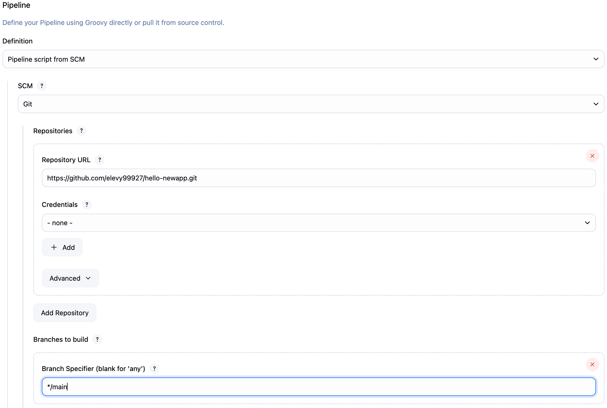
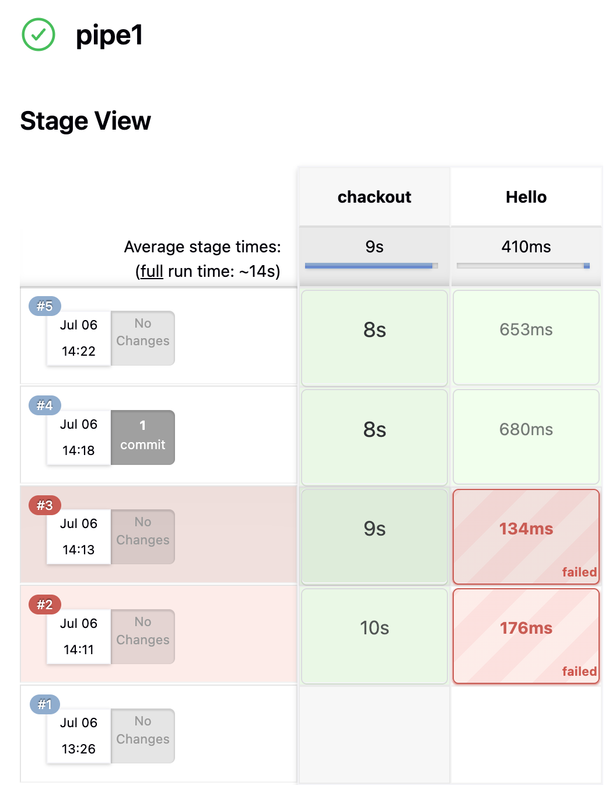

# Jenkins Kubernetes Pipeline

## 1. What are PodTemplates?

**PodTemplate** is a Jenkins Kubernetes plugin feature that defines how Jenkins agents run as Kubernetes pods.

**Key Concepts:**
- **Dynamic Agents**: Creates pods on-demand for pipeline execution
- **Container Templates**: Define different containers within the same pod
- **Resource Management**: Automatic cleanup after job completion
- **Isolation**: Each build runs in its own isolated environment

**Basic Structure:**
```groovy
podTemplate(containers: [
    containerTemplate(name: 'container-name', image: 'image:tag', ttyEnabled: true)
]) {
    node(POD_LABEL) {
        // Pipeline steps here
    }
}
```
## 2. Build Basic pipeline

Create new **Manual** pipeline.
- Jenkins -> 
- New Item - > 
- Enter an item name -> pipeline ->
- Script

Add the following code.

```java
def branch = env.BRANCH_NAME
def build = env.BUILD_NUMBER
def DEBUG = true
def DEPLOY = false


def kubernetesurl = "https://kubernetes.default.svc"


podTemplate(cloud: 'kubernetes', containers: [
    containerTemplate(
        name: 'jnlp', 
        image: 'jenkins/inbound-agent:latest'
    ),
     containerTemplate(
        name: 'docker', 
        image: 'docker:26-dind', // Use the latest stable DinD image
        privileged: true,      // Essential for Docker daemon to run
        args: '--storage-driver=vfs' // VFS is safest for K8s, though slower
    )], 
  volumes: [
    emptyDirVolume(mountPath: '/var/lib/docker', memory: false) // Q: Why do we need this volume?
  ]) {
    node(POD_LABEL) {
        stage('chackout') {
            container('jnlp') {
                echo "checkout"
          }
        } // end chackout

        stage('build') {
            container('docker') {
              echo "Building docker image..."
            }
        } //end build

        stage('deploy') {
            container('docker') {
	      if (DEPLOY) {
                echo "***** Doing some deployment stuff *********"
             }  else {
                echo "***** NO DEPLOY - Doing somthing else. Testing? *********"
             }
           }
        } //end deploy
    }
}

```


## 3. Build Advanced Pipeline

### Step 1: Login to Github
Login to `github` or any othe public git reposiroty.


### Step 2: Fork hello-newapp repo
[Hello Newapp repo](https://github.com/elevy99927/hello-newapp)


### Step 3: OR Create New Repository

1. **Create GitHub Repository**
   - Go to GitHub and create new repository: `hello-newapp`
   - Initialize with README
   - Clone to local machine:
   ```bash
   git clone https://github.com/YOUR_USERNAME/hello-newapp.git
   cd hello-newapp
   ```

### Step 4: Create Dockerfile and Jenkinsfile

**Create Dockerfile:**
```dockerfile
FROM nginx:alpine
COPY index.html /usr/share/nginx/html/
EXPOSE 80
CMD ["nginx", "-g", "daemon off;"]
```

**Create index.html:**
```html
<!DOCTYPE html>
<html>
<head><title>Hello from Jenkins K8s Pipeline</title></head>
<body>
    <h1>Hello World!</h1>
    <p>Built with Jenkins on Kubernetes</p>
</body>
</html>
```

**Create Jenkinsfile:**
In your Hello-newapp Repo, Create `Jenkinsfile`
```groovy
def appname = "hello-newapp"
def repo = "elevy99927"  // Replace with your DockerHub username
def appimage = "docker.io/${repo}/${appname}"
def apptag = "${env.BUILD_NUMBER}"

podTemplate(cloud: 'kubernetes', containers: [
    containerTemplate(
        name: 'jnlp', 
        image: 'jenkins/inbound-agent:latest'
    ),
     containerTemplate(
        name: 'docker', 
        image: 'docker:26-dind', // Use the latest stable DinD image
        privileged: true,      // Essential for Docker daemon to run
        args: '--storage-driver=vfs' // VFS is safest for K8s, though slower
    )], 
  volumes: [
    emptyDirVolume(mountPath: '/var/lib/docker', memory: false) // Q: Why do we need this volume?
  ]) {
    node(POD_LABEL) {
        stage('chackout') {
            container('jnlp') {
            sh '/usr/bin/git config --global http.sslVerify false'
	    checkout scm
          }
        } // end chackout

        stage('Hello') {
            container('docker') {
              echo "Building docker image..."
              sh "echo docker push $appimage"
            }
        } //end hello
    }
}

```

**Push to Repository:**
```bash
git add .
git commit -m "Add Dockerfile and Jenkinsfile"
git push origin main
```

### Step 5: Create Jenkins Pipeline from SCM

1. **Create New Pipeline Job**
   - Dashboard → New Item → Pipeline
   - Name: `k8s-pipeline-scm`

2. **Configure Pipeline from SCM**
   - Pipeline Definition: **"Pipeline script from SCM"**
   - SCM: **Git**
   - Repository URL: `https://github.com/YOUR_USERNAME/hello-newapp.git`
   - Branch: `*/main`
   - Script Path: `Jenkinsfile`



<BR>
<BR>
<BR>

3. **Save and Build**
   - Click "Save"
   - Click "Build Now"

### Check your pipeline



## 4. LAB Helm install 
- **Helm**: Create [helm](https://helm.sh/docs/intro/install/) Chart in your `git repo`. 
- **Helm install**: Install Helm in your pod template and run `echo helm install ./chart`
- **Helm template**: Install Helm in your pod template and run `echo helm template newapp ./chart`


---
Next Step: [Using Kaniko](./KanikoLab.md)