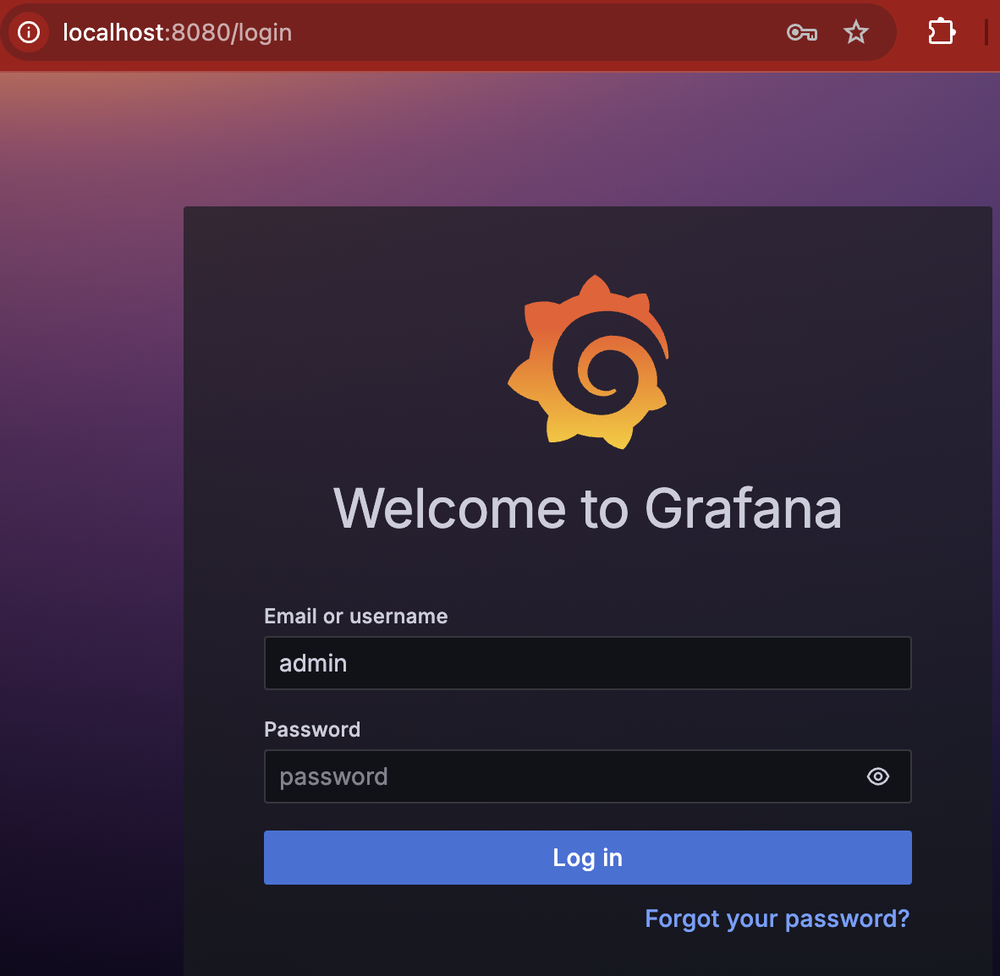

# Installation

## install prometheus

```sh
helm repo add bitnami https://charts.bitnami.com/bitnami
helm install my-prometheus bitnami/prometheus 

```

### Output
```h
⚠ WARNING: Since August 28th, 2025, only a limited subset of images/charts are available for free.
    Subscribe to Bitnami Secure Images to receive continued support and security updates.
    More info at https://bitnami.com and https://github.com/bitnami/containers/issues/83267

** Please be patient while the chart is being deployed **

Prometheus can be accessed via port "80" on the following DNS name from within your cluster:

    my-prometheus-server.default.svc.cluster.local

To access Prometheus from outside the cluster execute the following commands:

  NOTE: It may take a few minutes for the LoadBalancer IP to be available.
        Watch the status with: 'kubectl get svc --namespace default -w my-prometheus'

    export SERVICE_IP=$(kubectl get svc --namespace default my-prometheus --template "{{ range (index .status.loadBalancer.ingress 0) }}{{ . }}{{ end }}")
    echo "Prometheus URL: http://$SERVICE_IP/"

Watch the Alertmanager StatefulSet status using the command:

    kubectl get sts -w --namespace default -l app.kubernetes.io/name=my-prometheus-alertmanager,app.kubernetes.io/instance=my-prometheus

Alertmanager can be accessed via port "80" on the following DNS name from within your cluster:

    my-prometheus-alertmanager.default.svc.cluster.local

To access Alertmanager from outside the cluster execute the following commands:

  NOTE: It may take a few minutes for the LoadBalancer IP to be available.
        Watch the status with: 'kubectl get svc --namespace default -w my-prometheus-alertmanager'

    export SERVICE_IP=$(kubectl get svc --namespace default my-prometheus-alertmanager --template "{{ range (index .status.loadBalancer.ingress 0) }}{{ . }}{{ end }}")
    echo "Alertmanager URL: http://$SERVICE_IP/"

WARNING: There are "resources" sections in the chart not set. Using "resourcesPreset" is not recommended for production. For production installations, please set the following values according to your workload needs:
  - alertmanager.resources
  - server.resources
  - server.thanos.resources
+info https://kubernetes.io/docs/concepts/configuration/manage-resources-containers/
(base) MacBookPro:01-install eyallevy$     export SERVICE_IP=$(kubectl get svc --namespace default my-prometheus --template "{{ range (index .status.loadBalancer.ingress 0) }}{{ . }}{{ end }}")

```

---

## Install Grafana

```sh
helm install grafana bitnami/grafana
```


### output
```h
⚠ WARNING: Since August 28th, 2025, only a limited subset of images/charts are available for free.
    Subscribe to Bitnami Secure Images to receive continued support and security updates.
    More info at https://bitnami.com and https://github.com/bitnami/containers/issues/83267

** Please be patient while the chart is being deployed **

1. Get the application URL by running these commands:
    echo "Browse to http://127.0.0.1:8080"
    kubectl port-forward svc/grafana 8080:3000 &

2. Get the admin credentials:

    echo "User: admin"
    echo "Password: $(kubectl get secret grafana-admin --namespace default -o jsonpath="{.data.GF_SECURITY_ADMIN_PASSWORD}" | base64 -d)"
# Note: Do not include grafana.validateValues.database here. See https://github.com/bitnami/charts/issues/20629


WARNING: There are "resources" sections in the chart not set. Using "resourcesPreset" is not recommended for production. For production installations, please set the following values according to your workload needs:
  - grafana.resources
+info https://kubernetes.io/docs/concepts/configuration/manage-resources-containers/
```

---
### Login


- User: admin
- Password: `echo "Password: $(kubectl get secret grafana-admin --namespace default -o jsonpath="{.data.GF_SECURITY_ADMIN_PASSWORD}" | base64 -d)"`


---
### Hello world
