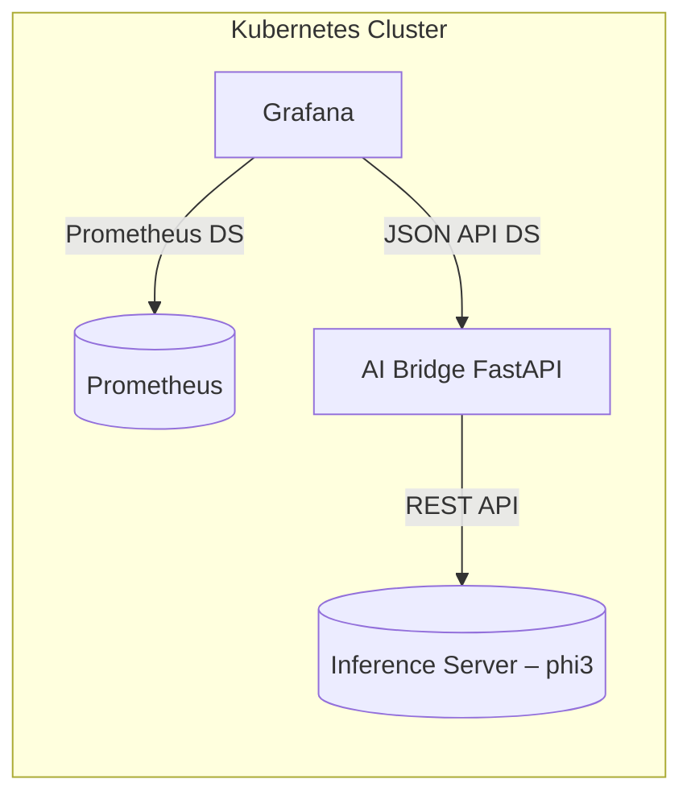

# תכנון פרויקט – Grafana + AI (High‑Level)

## 1. רשימת רכיבי המערכת

### רכיבי תשתית
* **Kubernetes Cluster** – סביבת ההרצה המרכזית לכל הרכיבים.
* **Prometheus** – איסוף ושאילתת מטריקות.
* **Grafana** – הצגת הדשבורדים וצריכת ה‑Data Sources.

### רכיבי AI
* **מודל מקומי (phi3)** – LLM שיורד מ‑Hugging Face ומאוחסן באופן מקומי.
* **Inference Server** (לדוגמה vLLM / Ollama / llama.cpp) – מריץ את המודל ומספק REST API פנימי.
* **AI‑Bridge Service** – שירות (FastAPI) שמשמש כמתווך: מושך נתונים מ‑Prometheus, שולח אותם למודל, ומחזיר סיכום ל‑Grafana.

### רכיבי אינטגרציה

* **Grafana Data Source Plugin** (JSON API) – מאפשר לגרפנה לקרוא את ה‑AI‑Bridge.
* **Dashboards** – דשבורדים מותאמים המציגים גם גרפים גולמיים (Prometheus) וגם פרשנות טקסטואלית (AI).
---

## תרשים ארכיטקטורה




---

## Create deploy and svc:
```yaml
# 10-phi3mini-deploy.yaml
apiVersion: apps/v1
kind: Deployment
metadata:
  name: phi3mini
spec:
  replicas: 1
  selector:
    matchLabels: { app: phi3mini }
  template:
    metadata:
      labels: { app: phi3mini }
    spec:
      containers:
        - name: ollama
          image: ollama/ollama:latest
          env:
            - name: OLLAMA_MODELS
              value: "/models"
          # Note: in offline mode no "ollama pull". The phi3:mini model must exist physically under /models
          command: ["/bin/sh","-c"]
          args:
            - >-
              /bin/ollama serve &
              sleep 2;
              curl -s localhost:11434/api/tags || true;
              tail -f /dev/null
          ports:
            - name: http
              containerPort: 11434
          volumeMounts:
            - name: model-vol
              mountPath: /models
              readOnly: true
          readinessProbe:
            httpGet:
              path: /api/version
              port: http
            initialDelaySeconds: 3
            periodSeconds: 5
          livenessProbe:
            httpGet:
              path: /api/version
              port: http
            initialDelaySeconds: 15
            periodSeconds: 10
      volumes:
        - name: model-vol
          persistentVolumeClaim:
            claimName: local-pvc
---
# 11-phi3mini-svc.yaml
apiVersion: v1
kind: Service
metadata:
  name: phi3mini
spec:
  selector: { app: phi3mini }
  ports:
    - name: http
      port: 11434
      targetPort: 11434
  type: ClusterIP
```


## download phi3:mini
get your pod
```bash
kubectl get po --show-labels
NAME                        READY   STATUS    RESTARTS   AGE     LABELS
phi3mini-7b8545b47d-ts8w6   1/1     Running   0          4m57s   app=phi3mini,pod-template-hash=7b8545b47d
```
dowload phi3:mini
```h
kubectl exec -it phi3mini-7b8545b47d-ts8w6 -- ollama pull phi3:mini
pulling manifest 
pulling 633fc5be925f: 100% ▕█████████████████████████████████████████████████████████████████████████████████████████████████████████████████████▏ 2.2 GB                         
pulling fa8235e5b48f: 100% ▕█████████████████████████████████████████████████████████████████████████████████████████████████████████████████████▏ 1.1 KB                         
pulling 542b217f179c: 100% ▕█████████████████████████████████████████████████████████████████████████████████████████████████████████████████████▏  148 B                         
pulling 8dde1baf1db0: 100% ▕█████████████████████████████████████████████████████████████████████████████████████████████████████████████████████▏   78 B                         
pulling 23291dc44752: 100% ▕█████████████████████████████████████████████████████████████████████████████████████████████████████████████████████▏  483 B                         
verifying sha256 digest 
writing manifest 
success 

```


## Check your model
```bash
kubectl port-forward svc/phi3mini 11434:11434 -n default

# Check version and tags
curl -s http://localhost:11434/api/version
curl -s http://localhost:11434/api/tags | jq .

# Inference test (chat)
curl -s http://localhost:11434/api/chat \
  -H 'Content-Type: application/json' \
  -d '{
    "model":"phi3:mini",
    "keep_alive":"24h",
    "messages":[{"role":"system","content":"You are a terse assistant."},{"role":"user","content":"hi ollama"}],
    "options":{
      "num_thread":8,
      "num_ctx":2048,
      "num_keep":128,
      "temperature":0.2
    }
  }' | jq -r '.message.content'

```
---

## Docker build metrics-ai-bridge
```dockerfile
FROM python:3.11-slim
RUN pip install fastapi uvicorn httpx numpy
WORKDIR /app
COPY app.py /app/app.py
EXPOSE 8080
CMD ["python", "-m", "uvicorn", "app:api", "--host", "0.0.0.0", "--port", "8080"]

```

```bash
docker build -t elevy99927/metrics-ai-bridge:phi3 .
docker push elevy99927/metrics-ai-bridge:phi3
```

---
## deploy metrics-ai-server
```bash
kubectl apply -f 20-bridge-deploy.yaml
```

## check your deployment

```bash
curl "http://localhost:8081/summary?query=up&minutes=30"

```

---
## output:
```h
curl "http://localhost:8081/summary?query=up&minutes=30"

{"summary":"Alertmanager is consistently available with an uptime percentage of 100% over the past half-hour at http://10.244.0.27:9093/metrics for Prometheus alerting system, while the Prometheus server (http://10.244.0.26:9090) also shows an uptime of 100%. Both services are running as expected without any downtime or performance degradation in their recent activity based on these metrics findings from both the Alertmanager and Prometheus server pods over a 30-minute time window.","query":"up","minutes":30,"stats_count":2}

```


## Grafana plugin
1. install plugin `Json API`
2. define datasource:

```json
# AI-dashboard.json
{
  "annotations": {
    "list": [
      {
        "builtIn": 1,
        "datasource": {
          "type": "grafana",
          "uid": "-- Grafana --"
        },
        "enable": true,
        "hide": true,
        "iconColor": "rgba(0, 211, 255, 1)",
        "name": "Annotations & Alerts",
        "type": "dashboard"
      }
    ]
  },
  "editable": true,
  "fiscalYearStartMonth": 0,
  "graphTooltip": 0,
  "id": 6,
  "links": [],
  "panels": [
    {
      "datasource": {
        "type": "prometheus",
        "uid": "fev7d6z0hvy80a"
      },
      "fieldConfig": {
        "defaults": {
          "color": {
            "mode": "palette-classic"
          },
          "custom": {
            "axisBorderShow": false,
            "axisCenteredZero": false,
            "axisColorMode": "text",
            "axisLabel": "",
            "axisPlacement": "auto",
            "barAlignment": 0,
            "barWidthFactor": 0.6,
            "drawStyle": "line",
            "fillOpacity": 0,
            "gradientMode": "none",
            "hideFrom": {
              "legend": false,
              "tooltip": false,
              "viz": false
            },
            "insertNulls": false,
            "lineInterpolation": "linear",
            "lineWidth": 1,
            "pointSize": 5,
            "scaleDistribution": {
              "type": "linear"
            },
            "showPoints": "auto",
            "spanNulls": false,
            "stacking": {
              "group": "A",
              "mode": "none"
            },
            "thresholdsStyle": {
              "mode": "off"
            }
          },
          "mappings": [],
          "thresholds": {
            "mode": "absolute",
            "steps": [
              {
                "color": "green",
                "value": 0
              },
              {
                "color": "red",
                "value": 80
              }
            ]
          }
        },
        "overrides": [
          {
            "__systemRef": "hideSeriesFrom",
            "matcher": {
              "id": "byNames",
              "options": {
                "mode": "exclude",
                "names": [
                  "{container=\"kindnet-cni\", endpoint=\"https-metrics\", id=\"/kubelet.slice/kubelet-kubepods.slice/kubelet-kubepods-pod262e376c_4576_45cc_8818_689b83ba78e7.slice/cri-containerd-ae7c7274fc427085f8167704afd1b031ca328065d08fed56a61f301a25dd99e8.scope\", image=\"docker.io/kindest/kindnetd:v20250214-acbabc1a\", instance=\"172.19.0.2:10250\", job=\"kubelet\", name=\"ae7c7274fc427085f8167704afd1b031ca328065d08fed56a61f301a25dd99e8\", namespace=\"kube-system\", node=\"kind-control-plane\", pod=\"kindnet-r8bm7\", service=\"prometheus-kube-prometheus-kubelet\"}"
                ],
                "prefix": "All except:",
                "readOnly": true
              }
            },
            "properties": [
              {
                "id": "custom.hideFrom",
                "value": {
                  "legend": false,
                  "tooltip": false,
                  "viz": true
                }
              }
            ]
          }
        ]
      },
      "gridPos": {
        "h": 8,
        "w": 12,
        "x": 0,
        "y": 0
      },
      "id": 4,
      "options": {
        "legend": {
          "calcs": [],
          "displayMode": "list",
          "placement": "bottom",
          "showLegend": true
        },
        "tooltip": {
          "hideZeros": false,
          "mode": "single",
          "sort": "none"
        }
      },
      "pluginVersion": "12.1.0",
      "targets": [
        {
          "disableTextWrap": false,
          "editorMode": "code",
          "expr": "rate(container_cpu_cfs_periods_total{container=\"kindnet-cni\"}[5m])",
          "fullMetaSearch": false,
          "includeNullMetadata": true,
          "legendFormat": "__auto",
          "range": true,
          "refId": "A",
          "useBackend": false
        }
      ],
      "title": "New panel",
      "type": "timeseries"
    },
    {
      "datasource": {
        "uid": "aev77monevq4gb"
      },
      "fieldConfig": {
        "defaults": {
          "color": {
            "mode": "thresholds"
          },
          "custom": {
            "align": "auto",
            "cellOptions": {
              "type": "auto",
              "wrapText": true
            },
            "inspect": false
          },
          "mappings": [],
          "thresholds": {
            "mode": "absolute",
            "steps": [
              {
                "color": "green",
                "value": 0
              },
              {
                "color": "red",
                "value": 80
              }
            ]
          }
        },
        "overrides": []
      },
      "gridPos": {
        "h": 8,
        "w": 12,
        "x": 12,
        "y": 0
      },
      "id": 3,
      "options": {
        "cellHeight": "sm",
        "footer": {
          "countRows": false,
          "fields": "",
          "reducer": [
            "sum"
          ],
          "show": false
        },
        "showHeader": true,
        "sortBy": [
          {
            "desc": false,
            "displayName": "summary"
          }
        ]
      },
      "pluginVersion": "12.1.0",
      "targets": [
        {
          "cacheDurationSeconds": 60,
          "fields": [
            {
              "jsonPath": "$.summary",
              "name": "summary",
              "type": "string"
            }
          ],
          "method": "GET",
          "params": [
            [
              "query",
              "container_fs_inodes_free"
            ]
          ],
          "queryParams": "",
          "refId": "A",
          "urlPath": "/summary"
        }
      ],
      "title": "AI Analysis - Service Health",
      "type": "table"
    },
    {
      "fieldConfig": {
        "defaults": {},
        "overrides": []
      },
      "gridPos": {
        "h": 8,
        "w": 12,
        "x": 0,
        "y": 8
      },
      "id": 2,
      "options": {
        "alertInstanceLabelFilter": "",
        "alertName": "",
        "dashboardAlerts": false,
        "groupBy": [],
        "groupMode": "default",
        "maxItems": 20,
        "showInactiveAlerts": false,
        "sortOrder": 1,
        "stateFilter": {
          "error": true,
          "firing": true,
          "noData": false,
          "normal": false,
          "pending": true,
          "recovering": true
        },
        "viewMode": "list"
      },
      "pluginVersion": "12.1.0",
      "title": "AI Analysis - Alerts",
      "transparent": true,
      "type": "alertlist"
    }
  ],
  "preload": false,
  "refresh": "",
  "schemaVersion": 41,
  "tags": [
    "ai",
    "metrics"
  ],
  "templating": {
    "list": []
  },
  "time": {
    "from": "now-5m",
    "to": "now"
  },
  "timepicker": {},
  "timezone": "browser",
  "title": "AI-Enhanced Metrics Dashboard",
  "uid": "a071e0bb-a928-4bab-b248-f8ca430b28e8",
  "version": 26
}

```
