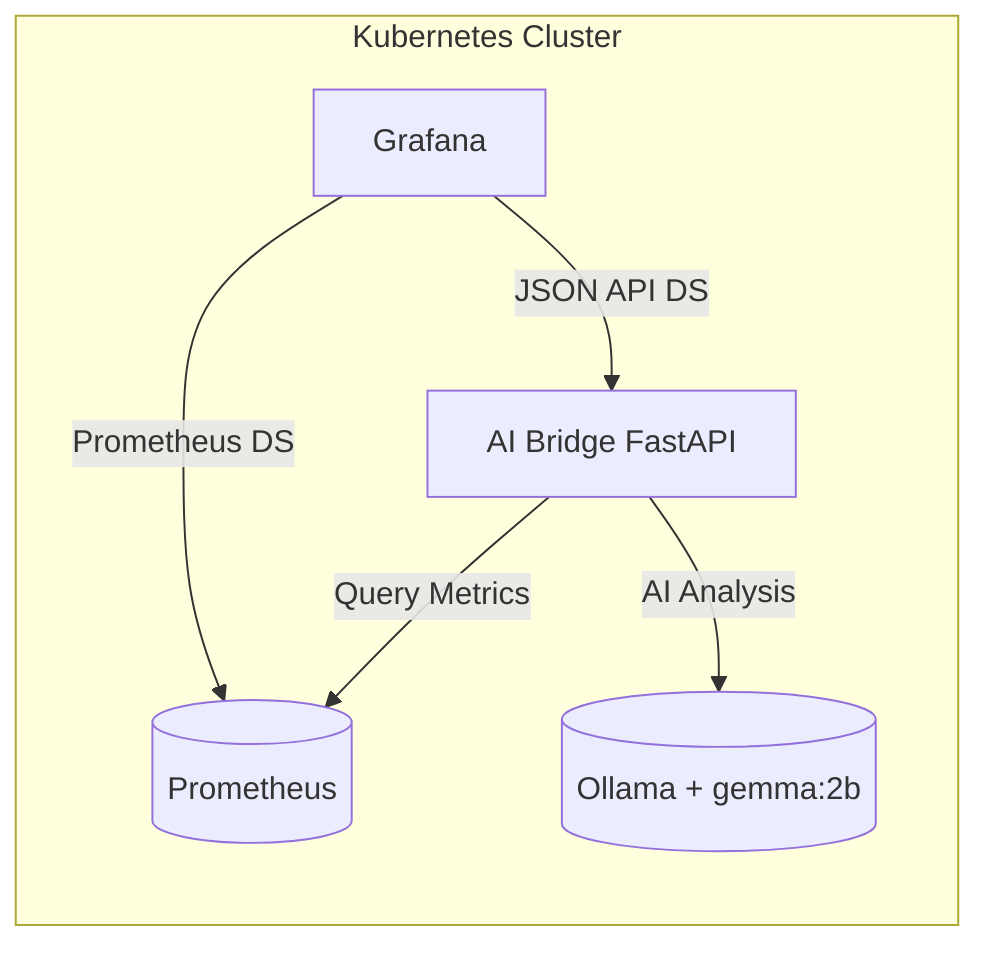

# AI-Enhanced Metrics Dashboard

An intelligent monitoring solution that combines Grafana dashboards with AI-powered analysis using local LLM models for automated metrics interpretation.

## Architecture Overview



## Components

### Core Infrastructure
- **Kubernetes Cluster** - Container orchestration platform
- **Prometheus** - Metrics collection and storage
- **Grafana** - Dashboard visualization and data source management

### AI Components
- **gemma:2b Model** - Local LLM for metrics analysis via Ollama (default)
- **Ollama Server** - Model inference server with REST API
- **AI Bridge Service** - FastAPI middleware connecting Prometheus to AI model

### Integration Layer
- **JSON API Plugin** - Grafana data source for AI-generated insights
- **Custom Dashboard** - Combined traditional metrics with AI analysis

## Quick Start

### 1. Deploy Ollama Model Server
```bash
kubectl apply -f 10-phi3mini-deploy.yaml
kubectl apply -f 11-phi3mini-svc.yaml
```

### 2. Download AI Model
```bash
kubectl exec -it <ollama-pod> -- ollama pull gemma:2b
```
```h
pulling manifest 
pulling 633fc5be925f: 100% ▕█████████████████████████████████████████████████████████████████████████████████████████████████████████████████████▏ 2.2 GB                         
pulling fa8235e5b48f: 100% ▕█████████████████████████████████████████████████████████████████████████████████████████████████████████████████████▏ 1.1 KB                         
pulling 542b217f179c: 100% ▕█████████████████████████████████████████████████████████████████████████████████████████████████████████████████████▏  148 B                         
pulling 8dde1baf1db0: 100% ▕█████████████████████████████████████████████████████████████████████████████████████████████████████████████████████▏   78 B                         
pulling 23291dc44752: 100% ▕█████████████████████████████████████████████████████████████████████████████████████████████████████████████████████▏  483 B                         
verifying sha256 digest 
writing manifest 
success 

```

### 3. Deploy AI Bridge Service
```bash
kubectl apply -f 20-bridge-deploy.yaml
kubectl apply -f 21-bridge-configmap.yaml
```

### 4. Configure Grafana
1. Install JSON API plugin
2. Add AI Bridge as data source
3. Import AI-dashboard.json

## Features

### AI-Powered Analysis
- **Automated Insights** - Natural language summaries of metric patterns
- **Trend Analysis** - AI interpretation of time-series data
- **Anomaly Detection** - Intelligent identification of unusual patterns
- **Contextual Alerts** - Smart alert correlation and explanation

### Performance Optimizations
- **Response Caching** - 5-minute TTL for repeated queries
- **Efficient Querying** - Optimized Prometheus query patterns
- **Resource Management** - Configurable model parameters

### Dashboard Components
- **Traditional Metrics** - Standard Prometheus visualizations
- **AI Summaries** - Natural language metric interpretations
- **Alert Analysis** - AI-enhanced alert context
- **Health Status** - Intelligent service health assessment

## API Endpoints

### AI Bridge Service
- `GET /` - Service health check
- `GET /summary?query=<promql>&minutes=<time>` - AI analysis of metrics
- `GET /cache/stats` - Cache performance metrics
- `POST /cache/clear` - Clear analysis cache

### Example Usage
```bash
# Get AI analysis of service uptime
curl "http://localhost:8081/summary?query=up&minutes=30"

# Response includes AI-generated summary
{
  "summary": "All monitored services show 100% uptime over the past 30 minutes...",
  "query": "up",
  "minutes": 30,
  "stats_count": 2
}
```

## Configuration

### Environment Variables
- `PROM_URL` - Prometheus server endpoint
- `OLLAMA_URL` - Ollama model server endpoint  
- `MODEL_NAME` - AI model identifier (default: gemma:2b)
- `CACHE_TTL` - Response cache duration in seconds

### Resource Requirements
- **gemma:2b Model**: ~2GB RAM, persistent storage for model files
- **AI Bridge**: ~512MB RAM, minimal CPU
- **Total**: ~3GB RAM recommended for stable operation

## Technical Details

### Model Selection
- **gemma:2b** - Optimized for resource efficiency and technical analysis
- **Local Deployment** - No external dependencies or data sharing
- **Customizable** - Easy to swap models via MODEL_NAME environment variable

### Integration Pattern
- **Non-intrusive** - Existing Grafana dashboards remain unchanged
- **Additive** - AI insights complement traditional monitoring
- **Scalable** - Horizontal scaling support for high-load environments

## Next Steps

1. **Custom Models** - Train domain-specific models for your metrics
2. **Advanced Analytics** - Implement predictive analysis capabilities  
3. **Multi-Model Support** - Deploy specialized models for different metric types
4. **Automated Actions** - Trigger remediation based on AI recommendations

---

## Deep Dive
### Dockerfile
```dockerfile
FROM python:3.11-slim
RUN pip install fastapi uvicorn httpx numpy
WORKDIR /app
COPY app.py /app/app.py
EXPOSE 8080
CMD ["python", "-m", "uvicorn", "app:api", "--host", "0.0.0.0", "--port", "8080"]
```

### Python Script app.py
```python
from fastapi import FastAPI, Query
import httpx
from numpy import mean, max as np_max, min as np_min
import os
import time
import json
import logging
import hashlib

logging.basicConfig(level=logging.INFO)
logger = logging.getLogger(__name__)

PROM = os.getenv("PROM_URL", "http://prometheus-server:80")
OLLAMA = os.getenv("OLLAMA_URL", "http://phi3mini:11434")
CACHE_TTL = int(os.getenv("CACHE_TTL", "300"))  # 5 minutes default
MODEL_NAME = os.getenv("MODEL_NAME", "gemma:2b")

api = FastAPI()
client = httpx.AsyncClient(timeout=60)

# Simple in-memory cache
cache = {}

def get_cache_key(query: str, minutes: int) -> str:
    return hashlib.md5(f"{query}:{minutes}".encode()).hexdigest()

def is_cache_valid(timestamp: float) -> bool:
    return time.time() - timestamp < CACHE_TTL

@api.get("/")
async def root():
    return {"message": "Metrics AI Bridge is running with phi3:mini"}

@api.get("/cache/stats")
async def cache_stats():
    valid_entries = sum(1 for entry in cache.values() if is_cache_valid(entry["timestamp"]))
    return {
        "total_entries": len(cache),
        "valid_entries": valid_entries,
        "cache_ttl": CACHE_TTL
    }

@api.post("/cache/clear")
async def clear_cache():
    cache.clear()
    return {"message": "Cache cleared"}

@api.get("/summary")
async def summarize(query: str = Query(...), minutes: int = 60):
    # Check cache first
    cache_key = get_cache_key(query, minutes)
    if cache_key in cache and is_cache_valid(cache[cache_key]["timestamp"]):
        logger.info(f"Cache hit for query: {query}")
        return cache[cache_key]["data"]
    # Get data from Prometheus
    now = int(time.time())
    start = now - minutes*60
    step = max(15, int(minutes*60/200))
    
    try:
        r = await client.get(f"{PROM}/api/v1/query_range", 
                           params={"query": query, "start": start, "end": now, "step": f"{step}s"})
        r.raise_for_status()
        response_data = r.json()
        data = response_data.get("data", {}).get("result", [])
    except (httpx.RequestError, httpx.HTTPStatusError) as e:
        logger.error(f"Prometheus connection error: {e}")
        return {"summary": f"Error connecting to Prometheus: {str(e)}", "query": query}
    except json.JSONDecodeError as e:
        logger.error(f"Prometheus JSON decode error: {e}")
        return {"summary": "Invalid response from Prometheus", "query": query}

    # Calculate basic statistics
    series_stats = []
    for s in data:
        vals = [float(v[1]) for v in s["values"] if v[1] not in (None, 'NaN')]
        if not vals: continue
        series_stats.append({
            "metric": s.get("metric", {}),
            "avg": mean(vals),
            "max": np_max(vals),
            "min": np_min(vals),
            "last": vals[-1],
            "trend": vals[-1] - vals[0]
        })

    if not series_stats:
        return {"summary": "No data found for the selected time window", "query": query}

    # Send to phi3:mini via Ollama
    prompt = f"""Analyze these metrics findings:
PromQL: {query}
Time window: {minutes} minutes
Statistics: {series_stats[:3]}

Provide a brief and practical summary."""

    try:
        ollama_response = await client.post(f"{OLLAMA}/api/chat", 
                                          json={
                                              "model": MODEL_NAME,
                                              "stream": False,
                                              "messages": [
                                                  {"role": "system", "content": "You are a DevOps metrics analyst. Be concise and practical."},
                                                  {"role": "user", "content": prompt}
                                              ]
                                          })
        ollama_response.raise_for_status()
        logger.info(f"phi3:mini response status: {ollama_response.status_code}")
        result = ollama_response.json()
        ai_summary = result.get("message", {}).get("content", "No response received from model")
                    
    except (httpx.RequestError, httpx.HTTPStatusError) as e:
        logger.error(f"phi3:mini connection error: {e}")
        ai_summary = f"Error connecting to phi3:mini: {str(e)}"
    except json.JSONDecodeError as e:
        logger.error(f"phi3:mini JSON decode error: {e}")
        ai_summary = "Invalid response from phi3:mini"

    result = {
        "summary": ai_summary,
        "query": query,
        "minutes": minutes,
        "stats_count": len(series_stats)
    }
    
    # Cache the result
    cache[cache_key] = {
        "data": result,
        "timestamp": time.time()
    }
    logger.info(f"Cached result for query: {query}")
    
    return result
```

---

*This solution demonstrates the integration of modern AI capabilities with traditional monitoring infrastructure, providing intelligent insights while maintaining full control over your data and models.*