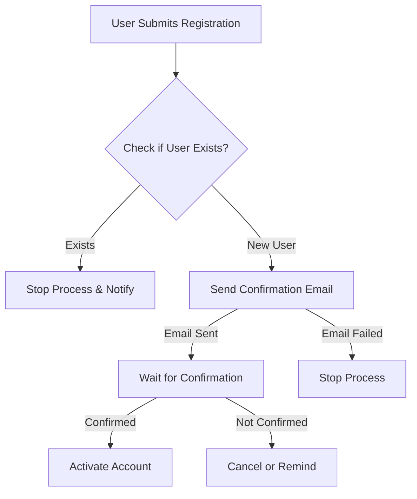
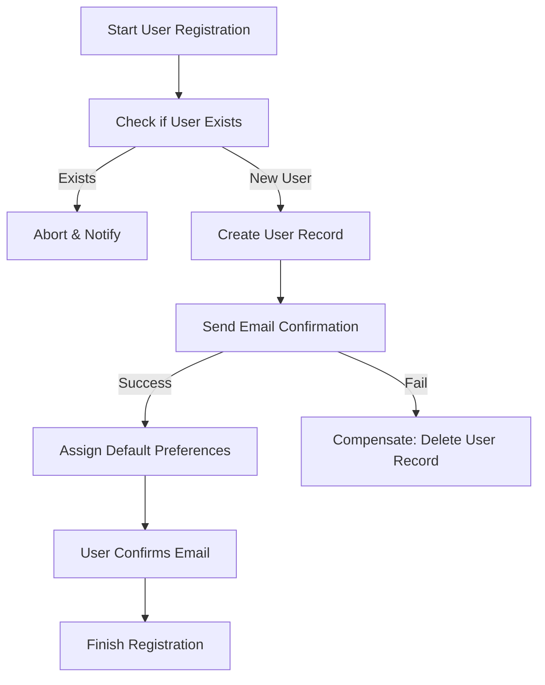
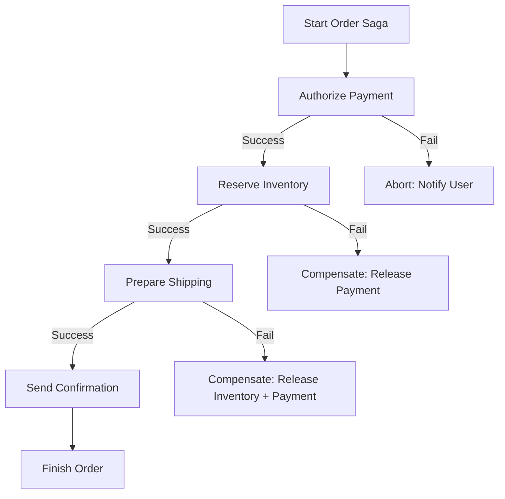

## Saga Design Pattern – Exercise Example

**Scenario background:**
User places an order on an e-commerce platform (similar to Amazon)

---
### 1. New User Registration (Saga Example 1)

1. **User submits registration form**
   * Input: name, email, password

2. **Service A: Check if user exists**
   * If user exists → Abort and notify

3. **Service B: Create user record**
   * Saves initial user profile in DB

4. **Service C: Send email confirmation**
   * Triggers email verification with token
   * If fails → Compensation: delete user record from step 3

5. **Service D: Assign default preferences**
   * Sets initial settings (language, theme, etc.)

6. **User confirms email**
   * Final activation step

**Exmaple 1:**

---
**Exmaple 2:**

---
### 1. Submit New Order (Saga Example 2)

1. **User submits an order**

   * Input: list of items, delivery address, payment method

2. **Service A: Payment Authorization**

   * Checks card validity and blocks amount
   * If fails → stop process and notify user

3. **Service B: Inventory Reservation**

   * Checks product availability and reserves items
   * If fails → Compensation: release payment block from step 2

4. **Service C: Shipping Preparation**

   * Allocates shipping slot and label
   * If fails → Compensation:

     * Release inventory from step 3
     * Release payment from step 2

5. **Service D: Confirmation Notification**

   * Sends confirmation email to user

6. **Saga completes**

   * All steps succeed → order finalized and committed

---

### Compensation Logic

Saga ensures that if any of the steps fails, the previous steps will be compensated in reverse order, ensuring eventual consistency across services.

---

### Example with Mermaid Diagram

---
### Next Step:
* Analyze real-world use of Saga in microservice architecture
