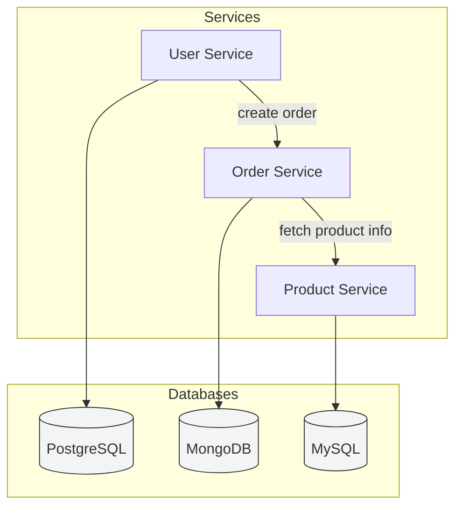

## Database per Service – Real-World Example

### Scenario: Online Store Architecture

The platform consists of several independent microservices:

* **User Service** – manages customer profiles and authentication
* **Order Service** – processes and tracks orders
* **Product Service** – maintains product catalog, pricing, and stock

### Service-wise Database Isolation

| Microservice    | Database Type | Data Stored                             |
| --------------- | ------------- | --------------------------------------- |
| User Service    | PostgreSQL    | User accounts, credentials, permissions |
| Order Service   | MongoDB       | Orders, payments, delivery tracking     |
| Product Service | MySQL         | Product listings, pricing, stock levels |

### Why Use Database per Service?

**Benefits:**

* **Isolation:** A failure in Order DB does not affect User Service.
* **Scalability:** Product Service can scale independently under high load.
* **Tech Freedom:** Choose DB technology best suited per service (e.g., documents for orders, relational for users).

### Challenges

* No joins between services → complex queries require orchestration
* Requires patterns like CQRS or event-driven sync for cross-data access

### Architecture Diagram (Mermaid)

---

### Summary

This pattern improves modularity and resilience in microservice environments. It is widely adopted in modern platforms such as Netflix, Amazon, and Spotify.

---
