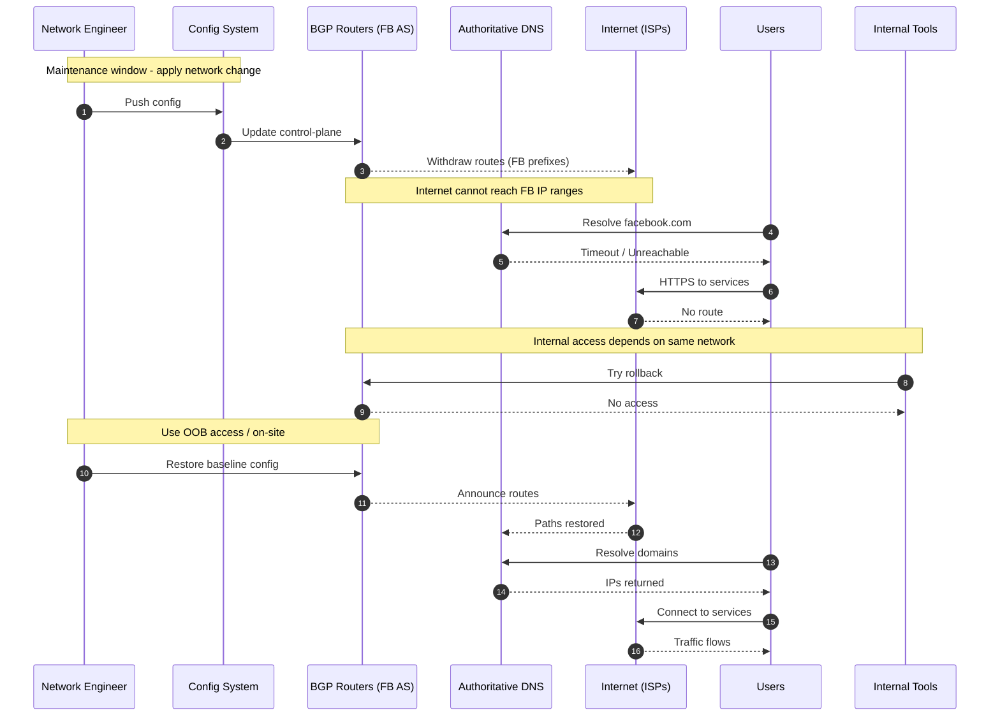

```mermaid
sequenceDiagram
    autonumber
    participant NetEng as Network Engineer
    participant Cfg as Config System
    participant BGP as BGP Routers (FB AS)
    participant DNS as Authoritative DNS
    participant IGW as Internet (ISPs)
    participant User as Users
    participant Tools as Internal Tools

    Note over NetEng,Cfg: Maintenance window - apply network change
    NetEng->>Cfg: Push config
    Cfg->>BGP: Update control-plane
    BGP-->>IGW: Withdraw routes (FB prefixes)

    Note over IGW,BGP: Internet cannot reach FB IP ranges
    User->>DNS: Resolve facebook.com
    DNS-->>User: Timeout / Unreachable

    User->>IGW: HTTPS to services
    IGW-->>User: No route

    Note over Tools,BGP: Internal access depends on same network
    Tools->>BGP: Try rollback
    BGP-->>Tools: No access

    Note over NetEng,BGP: Use OOB access / on-site
    NetEng->>BGP: Restore baseline config
    BGP-->>IGW: Announce routes

    IGW-->>DNS: Paths restored
    User->>DNS: Resolve domains
    DNS-->>User: IPs returned

    User->>IGW: Connect to services
    IGW-->>User: Traffic flows

```