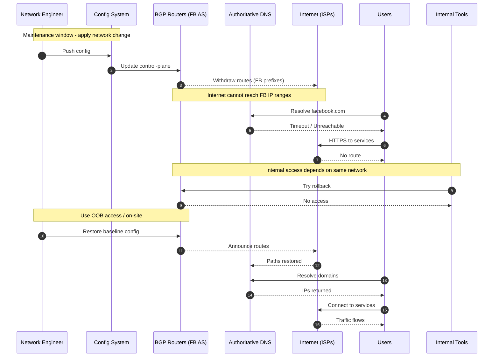

# Facebook 2021 Outage - Sequence Diagram

## SLA Impact Overview
The October 4, 2021 outage had a direct and severe impact on Facebook's **Service Level Agreement (SLA)** commitments. For major services with SLAs targeting very high availability (often 99.9% or higher), a **six-hour global outage** represented a significant breach. This single incident could consume the entire annual error budget for availability in just one day, potentially triggering SLA penalty clauses for enterprise customers and eroding trust with advertisers and partners. The outage highlighted the business risk of over-reliance on centralized infrastructure without adequate failover mechanisms.

Below is a visual representation of the events that occurred during the Facebook outage on October 4, 2021.

## Facebook SLA/SLO in 2021
In 2021, Facebook (now Meta) operated its core consumer services — Facebook, Instagram, WhatsApp, and Messenger — with an internal **SLO** of approximately **99.9% uptime** or higher. While Facebook did not publish a formal SLA for general consumers, enterprise-facing services (such as Workplace by Facebook) had documented SLAs targeting similar levels.

### Availability Calculation with 6+ Hours of Downtime
- Total hours in a year: **8,760**
- Outage duration: **6 hours 0 minutes** (approx.)
- Uptime percentage = \[ (8,760 − 6) / 8,760 \] × 100 = **99.9315%**

If the outage was slightly longer (e.g., 6h 15m = 6.25 hours):
- Uptime percentage = \[ (8,760 − 6.25) / 8,760 \] × 100 ≈ **99.9286%**

This means:
- The actual availability remained **above the 99.9% SLO**.
- For a service with a **99.99% SLO/SLA**, the downtime budget is only about 52 minutes/year — meaning this outage exceeded that limit by more than **7×**.

## Summary of the Incident
The October 4, 2021 Facebook outage was a major global event that lasted about six hours, taking down Facebook and all related services, including Instagram, WhatsApp, Messenger, and Oculus.

### Root Cause
1. **Misconfigured Network Change** – During maintenance, a network configuration update disconnected Facebook’s BGP (Border Gateway Protocol) routes from the internet.
2. **BGP Withdrawal** – Facebook’s routers withdrew their IP prefixes from global routing tables.
3. **DNS Unavailable** – Since Facebook’s authoritative DNS servers resided on the same network, they became unreachable.
4. **Internal Access Loss** – Internal tools and building access systems also failed, slowing the recovery process.

### Impact
- **Users:** Unable to access Facebook, Instagram, WhatsApp, and Oculus.
- **Businesses:** Lost communication channels, e-commerce capabilities, and ad revenue during the outage.
- **Revenue:** Estimated losses in the millions due to downtime in advertising.
- **Reputation:** Raised questions about redundancy planning and avoiding single points of failure.

### Technical Lessons
1. **Isolation of Network Management Components** – Avoid hosting BGP, DNS, and management systems in the same failure domain.
2. **Automated Change Validation** – Validate critical network configuration changes before deployment.
3. **Out-of-Band (OOB) Access** – Maintain separate management networks to recover from control-plane failures.
4. **Multi-Provider DNS** – Use redundant DNS providers to reduce the risk of total domain resolution failure.

**Key Lesson:** Critical infrastructure components (like DNS and network management systems) must be isolated and have redundant paths to prevent total outages from single configuration failures.
