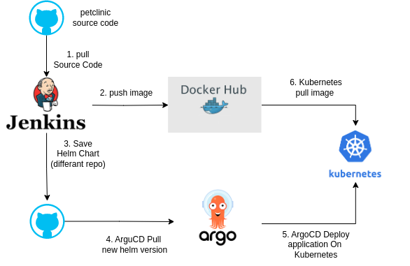

# Solution: spring-petclinic

 
### In Class and Home practice 
In the following LAB you will have to create a git Repo, Docker File , Docker Compose ,  Jenkins Pipeline and K8S Helm 
Clone https://github.com/spring-projects/spring-petclinic.git

Delete .git Folders metadata to remove the project from git
Create new Git repo in your account 
Add all the files project into your git repo (remote)

## PART I
Create a MULTI STEP BUILD docker file that will:

### Step 1
 Run SonarQube to check the code (it’s fine that it’s not breaking the build at the moment when an issue is being discovered)
  

### Step 2 
Run “./mvnw package” to build the artifact

### Step 3 
Create the final image with Java version 8 and use the above artifact as the CMD
 Copy all files from /target/*.jar from step 2 TO /code
 Make sure your CMD is:
 java -jar code/*.jar
 Push you image to your Docker hub repo with the following tags (this means you will have two labels for the same IMAGE every time one is being pushed, the LATEST will be overwritten):
<LI>latest
<LI>Build number

## PART II 
 Once you have your pipeline up and working,
 Create a helm chart with the following configuration

### Deployment Manifest
Create a deployment Manifest for the application
Get the following from <B>VALUES.YAML</b> file
<LI>Image name (Make sure it will always point YOUR-REPO/IMAGE:LATEST)
<LI>Label AND LABEL SELECTOR
<LI>Deployment name (From built in functions of helm)

### Service Manifest 
  Get the following from <B>VALUES</B> file
<LI>Service Type
<LI>Port mapping 80:8080
<LI>Label & label selector

### MYSQL DB Deployment manifest
Get the following from <B>VALUES</B> file
<LI>Image name (Make sure it will always point - mysql:5.7)
<LI>Label AND LABEL SELECTOR
<LI>Deployment name (From built in functions of helm)
</LI>Environment variables:
<LI> MYSQL_ROOT_PASSWORD=
<LI> MYSQL_ALLOW_EMPTY_PASSWORD=true
<LI> MYSQL_USER=petclinic
<LI> MYSQL_PASSWORD=petclinic
<LI> MYSQL_DATABASE=petclinic

## Part III
Store everything in your Git account under this project.
This will be used in our next session as part of our CD project (using ARGOCD) to complete your Continues Delivery to K8s.
### Step 1
<LI>Install Jenkins

`
kubectl apply -f https://raw.githubusercontent.com/elevy99927/Jenkins-k8s/main/Jenkins/01-jenkins-deployment.yaml
`

### Step 2
use the following Jenkinsfile as your pipeline baseline:

`
https://github.com/elevy99927/Jenkins-k8s/blob/main/Jenkins/Jenkinsfile

`

Your Jenkinsfile can't run on modern kubernetes, and you will need to fix it so it will use <A href="https://github.com/GoogleContainerTools/kaniko">Kaniko</a> instead (or any other solution you think will apply).

In addition, you are expected to do the following:
<li> Save your image in a repository (for example: docker.io)
<LI> Create a  Helm Chart for your application and store it on another repo (this repo will be used by ArgoCD) 

 Extra 1:</B> Add additional staps to your pipeline, For example "test", "Code Scan" etc. This steps are allowed to be empty

 Extra 2:</B> Add webhook to start the jenkins pipeline automaticly

## Part IV
<LI>Install ArgoCD

`
kubectl apply -n argocd -f https://raw.githubusercontent.com/argoproj/argo-cd/stable/manifests/install.yaml
`

Patch your ArgoCD Service:

`
kubectl patch svc argocd-server -n argocd -p '{"spec": {"type": "LoadBalancer"}}'
`

<LI> Create Argo Application for your project

# Test functionality:
<LI>Add a file to your project
<LI>Commit changes
<LI>Push to remote 
<LI>Start Jenkins job (or configure jenkins to run on every Commit in Jenkins
<LI>Watch Jenkins build and build your image
<LI>Watch ArgoCD Deploy new version of your applicaction

# Project Topology

